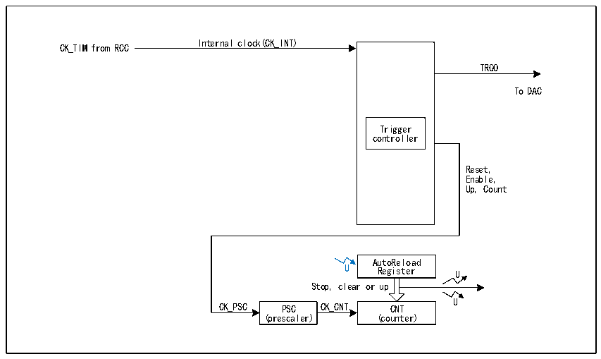

<!-- source-page: 265 -->

[← p.264](0264.md) · [index](../README.md) · [PDF p.265](https://ch32-riscv-ug.github.io/CH32V407/datasheet_en/CH32V407RM.PDF#page=265) · [p.266 →](0266.md)

<!-- header: CH32V407 Reference Manual https://wch-ic.com -->

# Chapter 16 Basic Timer (BCTM)

The basic timer module comprises two 16-bit auto-reloadable timers (TIM6 and TIM7) for counting and  
generating interrupts upon update events or DMA requests. TIM6 and TIM7 support 16-bit programmable  
prescalers. They can provide clocks for digital-to-analog conversion (DAC) and trigger DAC synchronization  
circuits. The basic timers operate independently and do not share any resources.  

## 16.1 Main Features

Main features of the basic timer include:  
● 16-bit auto-reload counter supporting increment mode  
● 16-bit prescaler with dynamically adjustable division factor from 1 to 65536  
● Triggered DAC synchronization circuit  
● Generates interrupts or DMA requests upon update events  

## 16.2 Principle and Structure

Figure 16-1 Block diagram of the structure of the basic timer  
 <!-- rendered from the PDF; verify at https://ch32-riscv-ug.github.io/CH32V407/datasheet_en/CH32V407RM.PDF#page=265 -->

🖼 Text parsed from the figure above

Internal clock(CK_INT)  
CK_TIM from RCC  
TRGO  
To DAC  
Trigger  
controller  
Reset,  
Enable,  
Up, Count  
AutoReload  
U Register U  
Stop, clear or up  
U  
CK_PSC PSC CK_CNT CNT  
(prescaler) (counter)  

### 16.2.1 Overview

As shown in Figure 16-1, the structure of the basic timer can be broadly divided into 2 parts: the input clock  
section and the core counter section.  
The clock for the basic timer originates from the HB bus clock (CK_INT). These input clock signals undergo  
various operations such as filtering and frequency division to become the CK_PSC clock, which is then output  
to the core counter section. Additionally, these complex clock sources can also be output as TRGO to the DAC  
peripheral.  
The core of the basic timer is a 16-bit counter (CNT). After CK_PSC is divided by the prescaler (PSC), it  
becomes CK_CNT and is finally lost to CNT. CNT supports increment counting mode and has an automatic  
<!-- image: p265-draw-image-00001 bbox=[499.92, 794.16, 519.84, 804.96] -->
<!-- footer: V1.2 263 -->
