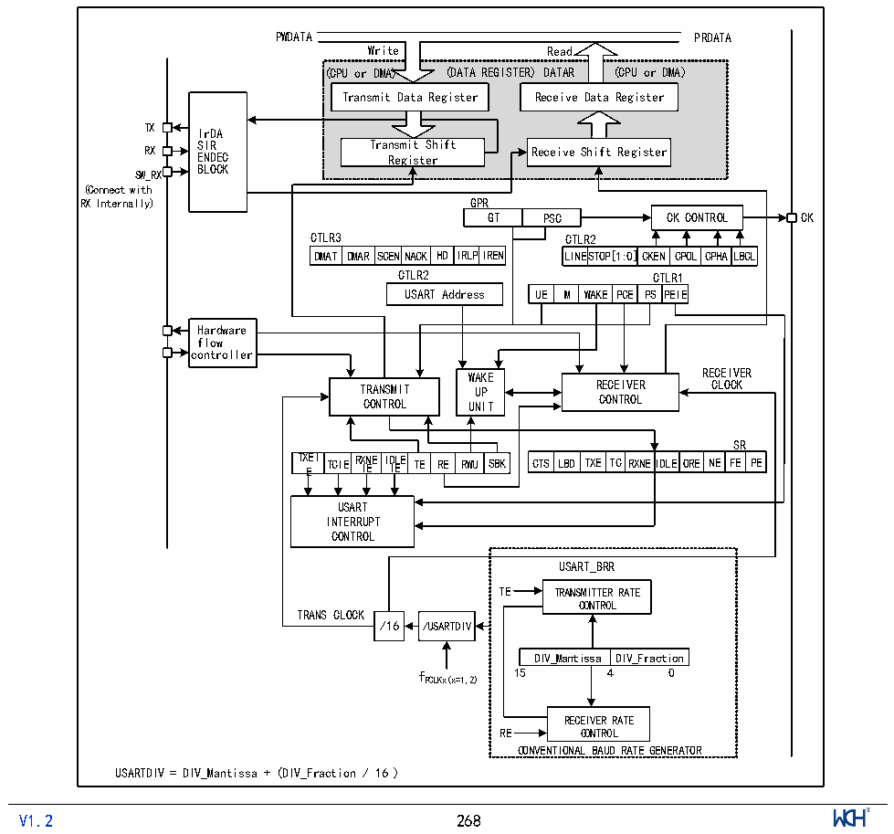

<!-- source-page: 270 -->

[← p.269](0269.md) · [index](../README.md) · [PDF p.270](https://ch32-riscv-ug.github.io/CH32V407/datasheet_en/CH32V407RM.PDF#page=270) · [p.271 →](0271.md)

<!-- header: CH32V407 Reference Manual https://wch-ic.com -->

# Chapter 17 Universal Synchronous Asynchronous Receiver Transmitter (USART)

The module contains 8 universal synchronous asynchronous transceivers (USART1/2/3/4/5/6/7/8/9/10).  

## 17.1 Main Features

● Full-duplex or half-duplex synchronous or asynchronous communication  
● NRZ data format  
● Fractional baud rate generator, highest 12.5Mbps  
● Programmable data length  
● Configurable stop bit  
● Support LIN, IrDA encoders, smart cards  
● Support DMA  
● Multiple interrupt sources  

## 17.2 Overview

Figure 17-1 USART block diagram  
 <!-- rendered from the PDF; verify at https://ch32-riscv-ug.github.io/CH32V407/datasheet_en/CH32V407RM.PDF#page=270 -->

🖼 Text parsed from the figure above

PWDATA PRDATA  
Write Read  
(CPU or DMA) (DATA REGISTER) DATAR (CPU or DMA)  
Transmit Data Register Receive Data Register  
<!-- image: p270-draw-image-00005 inside the figure -->
<!-- image: p270-draw-image-00004 inside the figure -->
TX IrDA  
RX S E I N R DEC Tra R ns eg m i i s t t S er hift Receive Shift Register  
BLOCK  
SW_RX  
(Connect with  
RX Internally) GPR  
GT PSC CK CONTROL CK  
CTLR3 CTLR2  
DMAT  DMAR  SCENNACK  HD  IRLP  
LINESTOP  P[1:0]  CKEN  CPOL  CPHA  ALBCL  
DMAT DMAR SCENNACK HD IRLPIREN LINESTOP[1:0]CKEN CPOL CPHALBCL  
CTLR2 CTLR1  
WAKE  PCE  PSCTPLER  ERI1E  
Hardware  
flow  
<!-- image: p270-draw-image-00002 inside the figure -->
<!-- image: p270-draw-image-00003 inside the figure -->
controller  
WWAAKKEE RECEIVER  
TRANSMIT UUPP RECEIVER CLOCK  
CONTROL UUNNIITT CONTROL  
TXEI TE  TCIE  RXNEID IE I  D I L E E TE  RE  RWU  
SR  
CTS LBD  TXE  TC  RXNE  IDLE  ORE  NE  FE  PE  
USART  
INTERRUPT  
CONTROL  
USART_BRR  
TE TRANSMITTER RATE  
CONTROL  
TRANS CLOCK  
/16 /USARTDIV  
DIV_Mantissa  DIV_Fraction  
f 15 4 0  
PCLKx(x=1,2)  
RECEIVER RATE  
RE CONTROL  
CONVENTIONAL BAUD RATE GENERATOR  
USARTDIV = DIV_Mantissa + (DIV_Fraction / 16 )  
<!-- image: p270-draw-image-00001 inside the figure -->
<!-- footer: V1.2 268 -->

