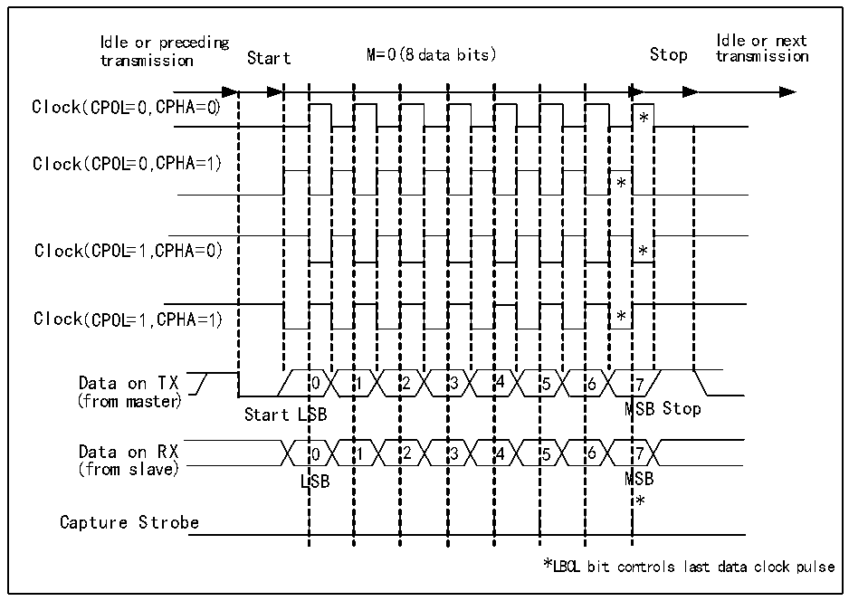
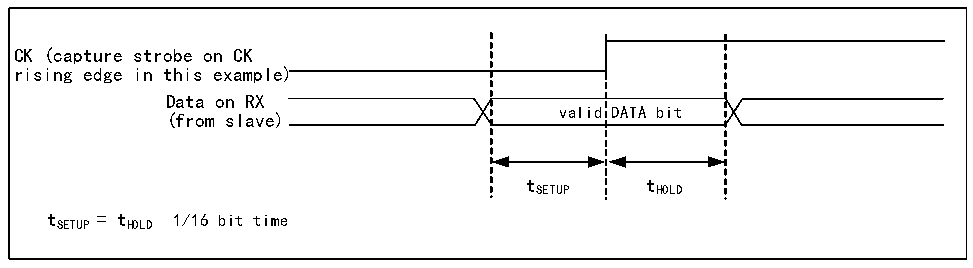

<!-- source-page: 272 -->

[← p.271](0271.md) · [index](../README.md) · [PDF p.272](https://ch32-riscv-ug.github.io/CH32V407/datasheet_en/CH32V407RM.PDF#page=272) · [p.273 →](0273.md)

<!-- header: CH32V407 Reference Manual https://wch-ic.com -->
The LBCL bit determines whether the clock is outputted when the last data bit is sent. The CPOL bit determines  
the polarity of the clock, and the CPHA determines the phase position of the clock. These 3 bits are in the  
control register 2 (R16_USARTx_CTLR2). These 3 bits need to be set when TE and RE are not enabled. The  
specific difference is shown in Figure 17-2.  
In the synchronous mode, the receiver will only sample when outputting the clock, and the slave needs to  
maintain a certain signal setup time and hold time, specifically as shown in Figure 17-3.  

Figure 17-2 Example of USART clock timing (M=0)  
 <!-- rendered from the PDF; verify at https://ch32-riscv-ug.github.io/CH32V407/datasheet_en/CH32V407RM.PDF#page=272 -->

🖼 Text parsed from the figure above

Idle or preceding Idle or next  
transmission Start M=0( 8 data bits) Stop transmission  
0SB0LSB  11  22  33  44  55  * * 6M6M  
Clock( CPOL=0 ,C PHA=0)  
*  *  7  
Clock(( CCPPOOLL==00 ,,C PHA=1))  
(from master)  
(from slave)  
*  
Capture Strobe  
*LBCL bit controls last data clock pulse  

Figure 17-3 Data sample hold time  
 <!-- rendered from the PDF; verify at https://ch32-riscv-ug.github.io/CH32V407/datasheet_en/CH32V407RM.PDF#page=272 -->

🖼 Text parsed from the figure above

valid  DATA bit  
CK (capture strobe on CK  
rising edge in this example)  
Data on RX  
(from slave)  
tSETUP tHOLD  
t SETUP = t HOLD 1/16 bit time  

## 17.5 1-wire Half-duplex Mode

The half-duplex mode supports the use of a single pin (only TX pin) to receive and transmit, and the TX pin  
and RX pin are connected inside the chip.  
<!-- image: p272-draw-image-00001 bbox=[499.92, 794.16, 519.84, 804.96] -->
<!-- footer: V1.2 270 -->
