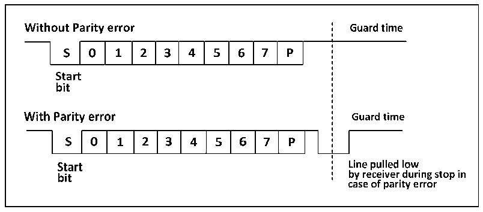

<!-- source-page: 273 -->

[← p.272](0272.md) · [index](../README.md) · [PDF p.273](https://ch32-riscv-ug.github.io/CH32V407/datasheet_en/CH32V407RM.PDF#page=273) · [p.274 →](0274.md)

<!-- header: CH32V407 Reference Manual https://wch-ic.com -->
To enable half-duplex mode, set HDSEL bit in the control register 3 (R16_USARTx_CTLR3), but you need  
to disable LIN mode, smartcard mode, infrared mode and synchronous mode at the same time, i.e., to ensure  
that the SCEN, CLKEN and IREN bits are in the reset status. These 3 bits are in the control register 2 and the  
control register 3 (R16_USARTx_CTLR2 and R16_USARTx_CTLR3).  
After setting to half-duplex mode, it is needed to set the TX IO port to open-drain output high mode. When  
TE bit is set, the data will be sent out as long as the data is written to the data register. Special attention shall  
be paid to the fact that bus conflicts may occur when multiple devices use a single bus to transmit and  
receive in half-duplex mode. This requires users to avoid it by software.  

## 17.6 Smart Card

The smartcard mode supports ISO7816-3 protocol to access the smart card controller.  
To enable smartcard mode, set the SCEN bit in the control register 3 (R16_USARTx_CTLR3), but it is needed  
to disable LIN mode, half-duplex mode and infrared mode at the same time, i.e., to ensure that the LINEN,  
HDSEL and IREN bits are in the reset status, but CLKEN can be switched on to output the clock. These 3 bits  
are in the control register 2 and the control register 3 (R16_USARTx_CTLR2 and R16_USARTx_CTLR3).  
In order to support smartcard mode, USART shall be set to 8 data bits plus 1 check bit. It is recommended that  
the stop bit be configured to 1.5 bits for both sending and receiving. The smart card mode is a 1-wire half-  
duplex protocol, which uses TX line as the data communication and shall be configured as open drain output  
plus pull-up. When the receiver receives a frame of data and detects a parity check error, it will send a NACK  
signal at the stop bit, i.e., actively reducing a cycle of TX during the stop bit. After the sender detects the  
NACK signal, a frame error will be generated, and the application can resend accordingly. Figure 17-4 shows  
the waveforms on the TX pin under correct conditions and in the event of parity check errors. The TC flag  
(transmission completion flag) of the USART can delay the generation of GT (protection time) clocks, and the  
receiver will not recognize the NACK signal set by itself as the start bit.  

Figure 17-4 (No) parity check error  
 <!-- rendered from the PDF; verify at https://ch32-riscv-ug.github.io/CH32V407/datasheet_en/CH32V407RM.PDF#page=273 -->

🖼 Text parsed from the figure above

<!-- image: p273-draw-image-00012 inside the figure -->
<!-- image: p273-draw-image-00015 inside the figure -->
<!-- image: p273-draw-image-00002 inside the figure -->
<!-- image: p273-draw-image-00003 inside the figure -->
<!-- image: p273-draw-image-00005 inside the figure -->
<!-- image: p273-draw-image-00006 inside the figure -->
<!-- image: p273-draw-image-00009 inside the figure -->
<!-- image: p273-draw-image-00004 inside the figure -->
<!-- image: p273-draw-image-00007 inside the figure -->
<!-- image: p273-draw-image-00008 inside the figure -->
<!-- image: p273-draw-image-00010 inside the figure -->
<!-- image: p273-draw-image-00011 inside the figure -->
<!-- image: p273-draw-image-00013 inside the figure -->
<!-- image: p273-draw-image-00014 inside the figure -->
<!-- image: p273-draw-image-00026 inside the figure -->
<!-- image: p273-draw-image-00029 inside the figure -->
<!-- image: p273-draw-image-00016 inside the figure -->
<!-- image: p273-draw-image-00017 inside the figure -->
<!-- image: p273-draw-image-00019 inside the figure -->
<!-- image: p273-draw-image-00020 inside the figure -->
<!-- image: p273-draw-image-00023 inside the figure -->
<!-- image: p273-draw-image-00018 inside the figure -->
<!-- image: p273-draw-image-00021 inside the figure -->
<!-- image: p273-draw-image-00022 inside the figure -->
<!-- image: p273-draw-image-00024 inside the figure -->
<!-- image: p273-draw-image-00025 inside the figure -->
<!-- image: p273-draw-image-00030 inside the figure -->
<!-- image: p273-draw-image-00027 inside the figure -->
<!-- image: p273-draw-image-00031 inside the figure -->
<!-- image: p273-draw-image-00028 inside the figure -->
<!-- image: p273-draw-image-00032 inside the figure -->

In smartcard mode, the output waveform after the CK pin is enabled has nothing to do with the communication.  
It only provides the clock for the smart card. Its value is the PB clock and then the 5-bit settable clock frequency  
division (the frequency division value is double of PSC, and the highest is frequency division 62).  

## 17.7 IrDA

USART module supports control IrDA infrared transceiver for physical layer communication. To use IrDA,  
<!-- image: p273-draw-image-00001 bbox=[499.92, 794.16, 519.84, 804.96] -->
<!-- footer: V1.2 271 -->
