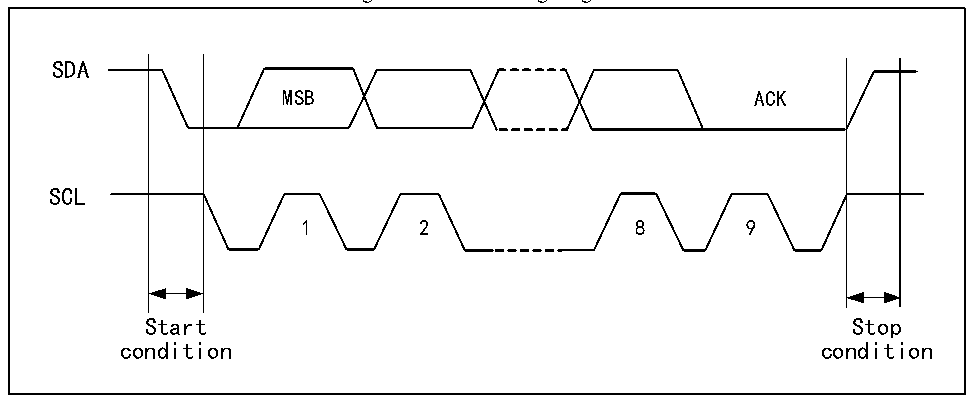

<!-- source-page: 286 -->

[← p.285](0285.md) · [index](../README.md) · [PDF p.286](https://ch32-riscv-ug.github.io/CH32V407/datasheet_en/CH32V407RM.PDF#page=286) · [p.287 →](0287.md)

<!-- header: CH32V407 Reference Manual https://wch-ic.com -->

# Chapter 18 Inter-integrated Circuit (I2C) Interface

The internal integrated circuit bus (I2C) is widely used in the communication between microcontrollers,  
sensors and other off-chip modules. It supports multi-master and multi-slave mode, and can communicate at  
both 100kHz (standard) and 400kHz (fast) speeds using only 2 wires (SDA and SCL). I2C bus is also  
compatible with SMBus protocol. It not only supports I2C timing, but also supports arbitration, timing and  
DMA, and has CRC check function.  

## 18.1 Main Features

● Master mode and slave mode  
● 7-bit or 10-bit address  
● Slave device supports dual 7-bit address.  
● Two speed modes: 100kHz and 400kHz  
● Multiple status modes, multiple error flags  
● Support extended clock function  
● 2 interrupt vectors  
● Support DMA  
● Support PEC  
● Compatible with SMBus  

## 18.2 Overview

I2C is a half-duplex bus, which can only run in one of the following 4 modes: master device sending mode,  
master device receiving mode, slave device sending mode and slave device receiving mode. The I2C module  
works in slave mode by default. After generating the starting condition, it will automatically switch to the  
master mode. When the arbitration is lost or a stop signal is generated, it will switch to the slave mode. The  
I2C module supports multi-host functions. When working in main mode, the I2C module will actively send  
out data and addresses. Data and addresses are transmitted in 8-bit units, with the high bit in front and the low  
bit in the back. After the start event is a byte (7-bit address mode) or two-byte (10-bit address mode) address.  
Every time the host sends 8-bit data or address, the slave needs to reply a reply ACK, that is, pull down the  
SDA bus, as shown in figure 18-1.  

Figure 18-1 I2C timing diagram  
 <!-- rendered from the PDF; verify at https://ch32-riscv-ug.github.io/CH32V407/datasheet_en/CH32V407RM.PDF#page=286 -->

🖼 Text parsed from the figure above

SDA  
MSB ACK  
SCL  
1 2 8 9  
Start Stop  
condition condition  

<!-- image: p286-draw-image-00001 bbox=[499.92, 794.16, 519.84, 804.96] -->
<!-- footer: V1.2 284 -->
