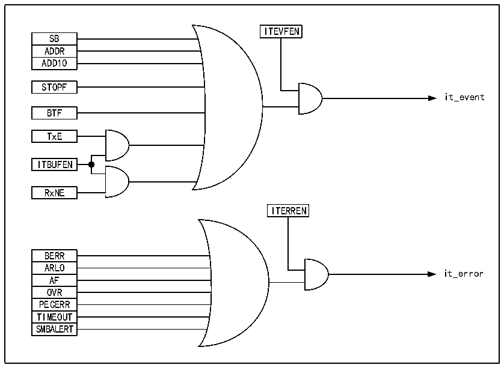

<!-- source-page: 291 -->

[← p.290](0290.md) · [index](../README.md) · [PDF p.291](https://ch32-riscv-ug.github.io/CH32V407/datasheet_en/CH32V407RM.PDF#page=291) · [p.292 →](0292.md)

<!-- header: CH32V407 Reference Manual https://wch-ic.com -->
2) 2-wire communication structure, of which a warning line can be selected for SMBus;  
3) Support 7-bit address format.  
Differences between SMBus and I2C:  
1) I2C supports the maximum speed of 400kHz, while SMBus supports the maximum speed of 100kHz, and  
SMBus has the minimum speed limit of 10kHz;  
2) When the SMBus clock is lower than 35mS, it will report a timeout, but I2C has no such limitation;  
3) SMBus has a fixed logic level, but I2C does not, depending on VDD;  
4) SMBus has a bus protocol, but I2C does not.  
SMBus also includes device identification, address resolution protocol, unique device identifier, SMBus  
reminder, and various bus protocols. For details, please refer to SMBus specification version 2.0. When  
SMBus is used, only the SMBus bit of the control register needs to be set, and the SMBTYPE and ENAARP  
bits need to be configured as needed.  

## 18.8 Interrupt

Each I2C module has 2 interrupt vectors: event interrupt and error interrupt. 2 types of interrupts support the  
interrupt sources as shown in Figure 18-4.  

Figure 18-4 I2C interrupt request  
 <!-- rendered from the PDF; verify at https://ch32-riscv-ug.github.io/CH32V407/datasheet_en/CH32V407RM.PDF#page=291 -->

🖼 Text parsed from the figure above

ITEVFEN  
SB  ADDR  ADD10  
STOPF  
it_event  
BTF  
TxE  
ITBUFEN  
RxNE  
<!-- image: p291-draw-image-00002 inside the figure -->
<!-- image: p291-draw-image-00003 inside the figure -->
ITERREN  
BERR  ARLO  AF  OVR  PECERR  TIMEOUT  SMBALERT  
it_error  

## 18.9 DMA

DMA can be used to receive/transmit bulk data. When DMA is used, the ITBUFEN bit of the control register  
cannot be set.  
<strong>● DMA is used for transmission</strong>  
The DMA mode can be activated by setting the DMAEN bit in the CTLR2 register. As long as the TxE bit is  
<!-- image: p291-draw-image-00001 bbox=[499.92, 794.16, 519.84, 804.96] -->
<!-- footer: V1.2 289 -->
