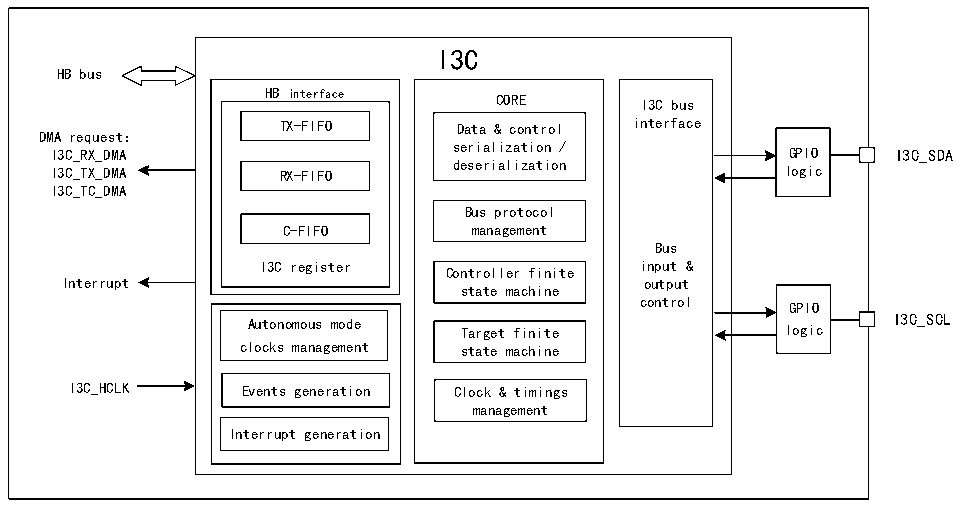

<!-- source-page: 303 -->

[← p.302](0302.md) · [index](../README.md) · [PDF p.303](https://ch32-riscv-ug.github.io/CH32V407/datasheet_en/CH32V407RM.PDF#page=303) · [p.304 →](0304.md)

<!-- header: CH32V407 Reference Manual https://wch-ic.com -->

# Chapter 19 I3C Bus (I3C)

The I3C bus is a 2-wire serial single-ended multi-drop bus designed to enhance the traditional I2C bus. The  
I3C interface handles communication between this device and other devices connected to the I3C bus. It  
supports operation as both a master and a slave device. When functioning as a master, it extends the capabilities  
of the I2C interface while maintaining a degree of backward compatibility.  

## 19.1 Main Features

● Support master and slave devices  
● Support MIPI I3C specification v1.1  
● Support multi-host functionality  
● Support DMA  
● In-band interrupt (IBI) capability  
● Hot join (HJ) function  
● Built-in error detection and recovery  
● Support dynamic address allocation, direct and broadcast common command codes (CCC), and  
private read/write transfers  

## 19.2 Overview

Figure 19-1 I3C timing diagram  
 <!-- rendered from the PDF; verify at https://ch32-riscv-ug.github.io/CH32V407/datasheet_en/CH32V407RM.PDF#page=303 -->

🖼 Text parsed from the figure above

I3C  
HB bus  
HB interface CORE I3C bus  
TX-FIFO Data &amp; control interface  
DMA request：  
serialization /  
I3C_RX_DMA GPIO I3C_SDA  
deserialization  
I3C_TX_DMA RX-FIFO logic  
I3C_TC_DMA  
Bus protocol  
C-FIFO management  
Bus  
I3C register Controller finite input &amp;  
Interrupt output  
state machine  
control GPIO  
Autonomous mode Target finite logic I3C_SCL  
clocks management state machine  
I3C_HCLK Events generation Clock &amp; timings  
management  
Interrupt generation  

## 19.3 Function Description

### 19.3.1 I3C Peripheral Status

I3C peripherals can be used as both I3C master devices and I3C slave devices. In any case, the peripheral is  
in one of the following states:  
<!-- image: p303-draw-image-00001 bbox=[499.92, 794.16, 519.84, 804.96] -->
<!-- footer: V1.2 301 -->
