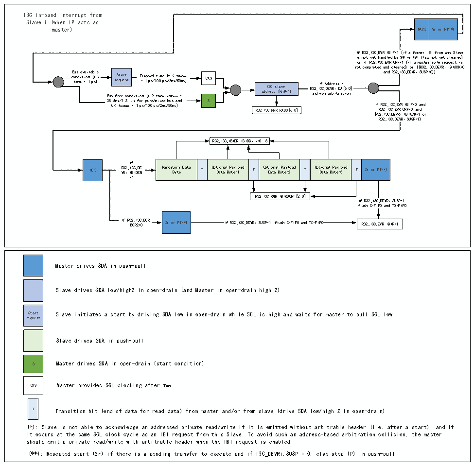

<!-- source-page: 312 -->

[← p.311](0311.md) · [index](../README.md) · [PDF p.312](https://ch32-riscv-ug.github.io/CH32V407/datasheet_en/CH32V407RM.PDF#page=312) · [p.313 →](0313.md)

<!-- header: CH32V407 Reference Manual https://wch-ic.com -->

#### 19.3.3.6 I3C IBI Transfer (as master devices)

Figure 19-7 I3C IBI Transfer (as master devices)  
 <!-- rendered from the PDF; verify at https://ch32-riscv-ug.github.io/CH32V407/datasheet_en/CH32V407RM.PDF#page=312 -->

🖼 Text parsed from the figure above

I3C in-band interrupt from  
NACK  Sr or P(**)  
Slave i (when IP acts as  
master) NACK Sr or P(**)  
If R32_I3C_EVR.IBIF=1 (if a former IBI from any Slave  
is not yet handled by SW ie IBI flag not yet cleared)  
or if R32_I3C_EVR.CRF=1 (if a master-role request is  
not completed and cleared) or ((R32_I3C_DEVRi.IBIACK=0  
c B o t u A n s V d A i L a t v i = a o i 1 n l μ a ( b s t l ) e &gt; Bus r f e S r t q e u a e e r t s c t onditio E = n l a 1 ( p μ t s e s &gt; d / 1 t t 0 C i 0 A m μ S e mi s n ( / / t B 2 U m F &lt; s m i / n t 5 C 0 = A m S s ma ) x CAS ad d I r 3 e C s s s l ( a R v n e W = i 1 ) R a 3 n 2_ d I I w 3 f C o n _ A D d E a d r V r b R e i i s t . s r D A a = t [ i 6: on 0 ] and R32_I3C_DEVRi.SUSP=0))  
38.4ns/1.3 μs for pure/mixed bus and S  
If  
R  
32  
_  
I  
3  
C  
_  
EV  
R.  
IB  
IF  
=0  
a  
n d  
t &lt; tCASmax = 1μs/100μs/2ms/50ms)  
R  
32  
_  
I  
3  
C  
_  
EV  
R.  
CR  
F=  
0  
a n  
d  
R32_I3C_RMR.RADD[6:0]  
(R32_I3C_DEVRi.IBIACK=1 or  
R32_I3C_DEVRi.SUSP=1)  
R32_I3C_IBIDR.IBIDBx x=0..3  
Mandatory Data Byte  T  Optional Payload Data Byte-1  T  Optional Payload Data Byte-2  T  Optional Payload Data Byte-3  T  Sr or P(**)  
If  
=1  
If R32_I3C_ flush C-FI  _DEVRi.SUSP=1: FO and TX-FIFO  
R32_I3C_RMR.IBIRDCNT[2:0]  
If R3 B 2 C _ R I 2 3 = C 0 _ BCR. Sr or P(**) If R32_I3C_DEVRi.SUSP=1: flush C-FIFO and TX-FIFO R32_I3C_EVR.IBIF=1  
Master drives SDA in push-pull  
Slave drives SDA low/highZ in open-drain (and Master in open-drain high Z)  
Start Slave initiates a start by driving SDA low in open-drain while SCL is high and waits for master to pull SCL low  
request  
Slave drives SDA in push-pull  
S Master drives SDA in open-drain (start condition)  
CAS Master provides SCL clocking after tCAS  
T Transition bit (end of data for read data) from master and/or from slave (drive SDA low/high Z in open-drain)  
(*): Slave is not able to acknowledge an addressed private read/write if it is emitted without arbitrable header (i.e. after a start), and if  
it occurs at the same SCL clock cycle as an IBI request from this Slave. To avoid such an address-based arbitration collision, the master  
should emit a private read/write with arbitrable header when the IBI request is enabled.  
(**): Repeated start (Sr) if there is a pending transfer to execute and if I3C_DEVRi.SUSP = 0, else stop (P) in push-pull  

When the peripheral operates as the master device, the R32_I3C_IBIDR register is used to receive the IBI data  
payload. Therefore, IBI requests from the slave device must not exceed a 4-byte data payload. If more  
information needs to be exchanged within the context of this in-band interrupt, the master device software  
must issue a private read control word.  

#### 19.3.3.7 I3C Hot Join Request Transfer (as master devices)

<!-- image: p312-draw-image-00001 bbox=[499.92, 794.16, 519.84, 804.96] -->
<!-- footer: V1.2 310 -->
