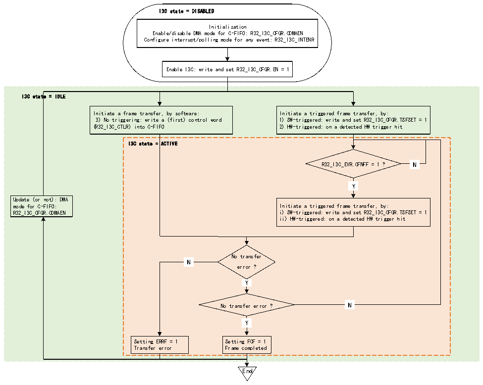

<!-- source-page: 314 -->

[← p.313](0313.md) · [index](../README.md) · [PDF p.314](https://ch32-riscv-ug.github.io/CH32V407/datasheet_en/CH32V407RM.PDF#page=314) · [p.315 →](0315.md)

<!-- header: CH32V407 Reference Manual https://wch-ic.com -->

### 19.3.4 I3C FIFO Management

<!-- p314-table-001 (table-19-1@1) -->
<table><caption>Table 19-1 I3C FIFO implementation</caption><tr><th>FIFO</th><th>Content</th><th>Unit</th><th>Size</th><th>Act as a master/slave (basic principle)</th></tr><tr><td>C-FIFO</td><td>32-bit control word</td><td>Word</td><td>2</td><td style="text-align:left">Master device (a frame can be based on multiple control words; But not when used as a slave device)</td></tr><tr><td>TX-FIFO</td><td>Transmitted data</td><td rowspan="2">Byte</td><td rowspan="2">8</td><td rowspan="2">Master devices</td></tr><tr><td style="text-align:left">RX- FIFO</td><td>Received data</td></tr></table>

#### 19.3.4.1 C-FIFO Management (as master)

When it is used as a master device, it can be used during C-FIFO broadcast CCC, direct read/write CCC,  
private read/write, traditional I2C read/write, and software-initiated error recovery.  
Figure 19-9 illustrates how to manage the C-FIFO to queue the control words on the I3C bus when the I3C  
peripheral is used as the master device.  

Figure 19-9 C-FIFO management (as master)  
 <!-- rendered from the PDF; verify at https://ch32-riscv-ug.github.io/CH32V407/datasheet_en/CH32V407RM.PDF#page=314 -->

🖼 Text parsed from the figure above

I3C state = DISABLED  
Initialization  
Enable/disable DMA mode for C-FIFO: R32_I3C_CFGR.CDMAEN  
Configure interrupt/polling mode for any event: R32_I3C_INTENR  
Enable I3C: write and set R32_I3C_CFGR.EN = 1  
I3C state = IDLE  
Initiate a frame transfer, by software: Initiate a triggered frame transfer, by:  
3) No triggering: write a (first) control word 1) SW-triggered: write and set R32_I3C_CFGR.TSFSET = 1  
(R32_I3C_CTLR) into C-FIFO 2) HW-triggered: on a detected HW trigger hit  
I3C state = ACTIVE  
N  N  
R32_I3C_EVR.CFNFF = 1 ? N  
Y  Y  
Update (or not): DMA  
mode for C-FIFO: Initiate a triggered frame transfer, by:  
R32_I3C_CFGR.CDMAEN i) SW-triggered: write and set R32_I3C_CFGR.TSFSET = 1  
ii) HW-triggered: on a detected HW trigger hit  
No transfer  
N  N  
error ?  
Y  Y  
N  N  
No transfer error ? N  
Y  Y  
Setting ERRF = 1 Setting FCF = 1  
Transfer error Frame completed  
End  

First, the software must initialize the C-FIFO management through the R32_I3C_CFGR register CDMAEN,  
and the specific steps are as follows:  
● The software writes directly according to the control word (when CDMAEN=0):  
<!-- image: p314-draw-image-00001 bbox=[499.92, 794.16, 519.84, 804.96] -->
<!-- footer: V1.2 312 -->
