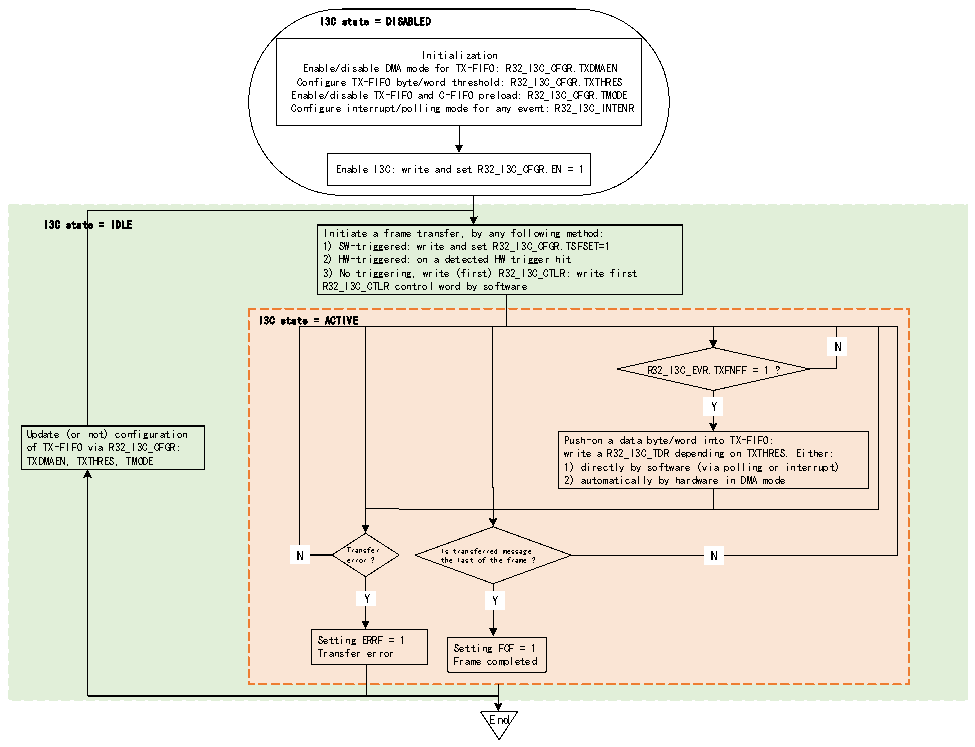

<!-- source-page: 316 -->

[← p.315](0315.md) · [index](../README.md) · [PDF p.316](https://ch32-riscv-ug.github.io/CH32V407/datasheet_en/CH32V407RM.PDF#page=316) · [p.317 →](0317.md)

<!-- header: CH32V407 Reference Manual https://wch-ic.com -->

Figure 19-10 TX-FIFO management (as master)  
 <!-- rendered from the PDF; verify at https://ch32-riscv-ug.github.io/CH32V407/datasheet_en/CH32V407RM.PDF#page=316 -->

🖼 Text parsed from the figure above

I3C state = DISABLED  
Initialization  
Enable/disable DMA mode for TX-FIFO: R32_I3C_CFGR.TXDMAEN  
Configure TX-FIFO byte/word threshold: R32_I3C_CFGR.TXTHRES  
Enable/disable TX-FIFO and C-FIFO preload: R32_I3C_CFGR.TMODE  
Configure interrupt/polling mode for any event: R32_I3C_INTENR  
Enable I3C: write and set R32_I3C_CFGR.EN = 1  
I3C state = IDLE  
Initiate a frame transfer, by any following method:  
1) SW-triggered: write and set R32_I3C_CFGR.TSFSET=1  
2) HW-triggered: on a detected HW trigger hit  
3) No triggering, write (first) R32_I3C_CTLR: write first  
R32_I3C_CTLR control word by software  
I3C state = ACTIVE  
N  N  
R32_I3C_EVR.TXFNFF = 1 ?  
Y  Y  
Update (or not) configuration Push-on a data byte/word into TX-FIFO:  
of TX-FIFO via R32_I3C_CFGR: write a R32_I3C_TDR depending on TXTHRES. Either:  
TXDMAEN, TXTHRES, TMODE 1) directly by software (via polling or interrupt)  
2) automatically by hardware in DMA mode  
N  N  
N Transfer Is transferred message N  
error ? the last of the frame ?  
Y  Y  
Y  Y  
Y Y  
Setting ERRF = 1  
Transfer error Setting FCF = 1  
Frame completed  
End  

First, TX-FIFO management must be initialized through the following fields in the R32_I3C_CFGR register:  
● TXDMAEN: Enable/disable DMA mode for the TX-FIFO  
● TXTHRES: Push data bytes or words into the TX-FIFO  
● TMODE: Enable/disable TX-FIFO and C-FIFO preload  
Then, according to the TXDMAEN bit in R32_I3C_CFGR register, there are two ways to write data into the  
TX-FIFO:  
● Software writes directly by byte/word (when TXDMAEN=0):  
–Through polling mode (R32_I3C_INTENR register TXFNFIE=0): Wait for the hardware to request the next  
data byte/word (R32_I3C_INTENR register TXFNFF = 1) before explicitly writing to R32_I3C_TDR or  
R32_I3C_TDWR register, depending on R32_I3C_CGFR register TXTHRES.  
–Through enabled interrupt notification (when TXFNFIE = 1)  
● Written by the assigned DMA channel (when TXDMAEN = 1) to enable the corresponding I3C  
peripheral DMA request:  
–According to the configuration at DMA module level, DMA will automatically push/write data bytes/words  
from its memory source buffer into R32_I3C_TDR or R32_I3C_TDWR register (depending on the TXTHRES  
bit in R32_I3C_CGFR register) until the frame is completed (after the last message of the frame, a stop bit  
will be issued on I3C bus), except when a transmission error occurs.  
I3C messages start with a start bit or a repeat start bit and end with a stop bit or a repeat start bit. At the message  
level, the last data byte/word to be sent is indicated by the R32_I3C_EVR register TXLASTF=1. When the  
I3C frame contains multiple messages (separated by repeated start bits), the software can use this event to  
<!-- image: p316-draw-image-00001 bbox=[499.92, 794.16, 519.84, 804.96] -->
<!-- footer: V1.2 314 -->
