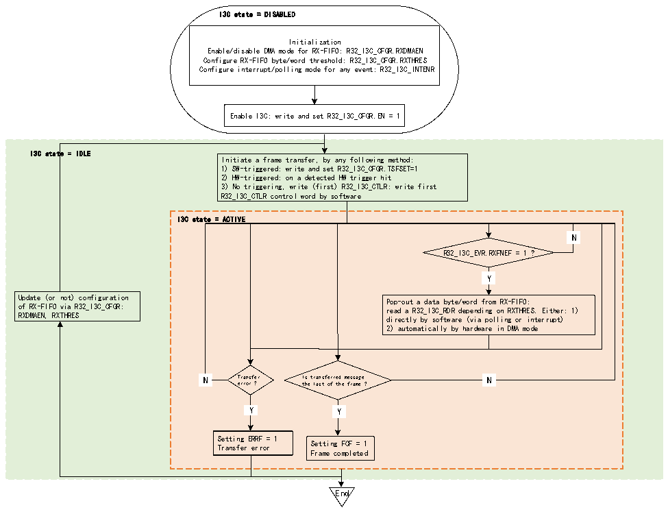

<!-- source-page: 318 -->

[← p.317](0317.md) · [index](../README.md) · [PDF p.318](https://ch32-riscv-ug.github.io/CH32V407/datasheet_en/CH32V407RM.PDF#page=318) · [p.319 →](0319.md)

<!-- header: CH32V407 Reference Manual https://wch-ic.com -->
When used as a master device, RX-FIFO can be used during broadcasting ENTDAA CCC, direct CCC reading  
(including direct RSTACT CCC reading), private reading and traditional I2C reading.  
Figure 19-11 illustrates how to manage the RX-FIFO to queue and eject data bytes or words to be received on  
the I3C bus when the I3C peripheral is used as the master device.  

Figure 19-11 RX-FIFO management (as master)  
 <!-- rendered from the PDF; verify at https://ch32-riscv-ug.github.io/CH32V407/datasheet_en/CH32V407RM.PDF#page=318 -->

🖼 Text parsed from the figure above

I3C state = DISABLED  
Initialization  
Enable/disable DMA mode for RX-FIFO: R32_I3C_CFGR.RXDMAEN  
Configure RX-FIFO byte/word threshold: R32_I3C_CFGR.RXTHRES  
Configure interrupt/polling mode for any event: R32_I3C_INTENR  
Enable I3C: write and set R32_I3C_CFGR.EN = 1  
I3C state = IDLE  
Initiate a frame transfer, by any following method:  
1) SW-triggered: write and set R32_I3C_CFGR.TSFSET=1  
2) HW-triggered: on a detected HW trigger hit  
3) No triggering, write (first) R32_I3C_CTLR: write first  
R32_I3C_CTLR control word by software  
I3C state = ACTIVE  
N  N  
R32_I3C_EVR.RXFNEF = 1 ?  
Y  Y  
Update (or not) configuration Pop-out a data byte/word from RX-FIFO:  
of RX-FIFO via R32_I3C_CFGR: read a R32_I3C_RDR depending on RXTHRES. Either: 1)  
RXDMAEN, RXTHRES directly by software (via polling or interrupt)  
2) automatically by hardware in DMA mode  
N  N  
N Transfer Is transferred message N  
error ? the last of the frame ?  
Y  Y  
Y  Y  
Y Y  
Setting ERRF = 1  
Transfer error Setting FCF = 1  
Frame completed  
End  

First, the software must initialize the RX-FIFO management through the following fields in the  
R32_I3C_CFGR register:  
● RXDMAEN: Enable/disable DMA mode for the RX-FIFO  
● RXTHRES: Pop data bytes or words from the RX-FIFO  
Then, read the RX-FIFO according to the RXDMAEN bit:  
● Software reads directly by byte/word (RXDMAEN=0):  
–Through polling mode (RXFNEIE=0 in R32_I3C_INTENR register): Wait for the hardware to request the  
next data byte/word (RXFNEF=1 in R32_I3C_INTENR register) before explicitly reading R32_I3C_RDR or  
R32_I3C_RDWR register, depending on R32_I3C_CGFR register.  
–Notify via enabled interrupt (if R32_I3C_INTENR register RXFNEIE=1)  
● Read by the assigned DMA channel (if RXDMAEN=1) to enable the corresponding I3C peripheral DMA  
request:  
–According to the configuration at DMA module level, DMA will automatically pop up/read data bytes/words  
from R32_I3C_RDR or R32_I3C_RDWR register (depending on the RXTHRES bit) and write them into its  
memory slave buffer until the frame is completed (after the last message of the frame, a stop bit will be issued  
on the I3C bus), except when a transmission error occurs.  
<!-- image: p318-draw-image-00001 bbox=[499.92, 794.16, 519.84, 804.96] -->
<!-- footer: V1.2 316 -->
