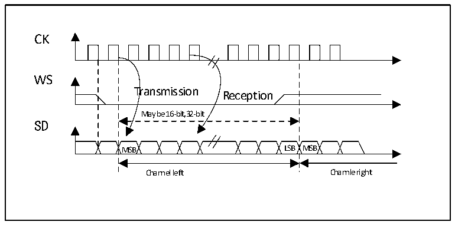

<!-- source-page: 348 -->

[← p.347](0347.md) · [index](../README.md) · [PDF p.348](https://ch32-riscv-ug.github.io/CH32V407/datasheet_en/CH32V407RM.PDF#page=348) · [p.349 →](0349.md)

<!-- header: CH32V407 Reference Manual https://wch-ic.com -->
configuration register I2SCFGR (Can set the audio standard, slave/master mode, data format, packet frame,  
clock pole parameters, etc.). Register CTLR1 and all CRCR registers are not used in I2S mode. Similarly, the  
SSOE bit in the CTLR2 register, and the MODF bit and the CRCERR bit in the register STATR are not used  
in the I2S mode. I2S uses the same register DATAR as SPI for 16-bit wide mode data transfer.  

### 20.3.2 Supported Audio Protocols

The 3-wire bus supports time division multiplexing of audio data on 2 channels: left and right, but only one  
16-bit register is used for transmit or receive. Therefore, when writing data to the data register, the software  
must write the corresponding data according to the channel currently being transmitted; similarly, when  
reading the register data, check the CHSIDE bit of the register STATR to determine which channel the received  
data belongs to. The left channel always sends data before the right channel (The CHSIDE bit has no meaning  
under the PCM protocol). There are 4 available data and packet frame combinations. Data can be sent in the  
following 4 data formats:  
- 16-bit data is packed into 16-bit frames
- 16-bit data is packed into 32-bit frames
- 24-bit data is packed into 32-bit frames
- 32-bit data is packed into 32-bit frames
When using 16-bit data to expand to a 32-bit frame, the first 16 bits (MSB) are meaningful data, and the last  
16 bits (LSB) are forced to 0. This operation requires no software intervention and no DMA request (Only  
requires a read or write operation). 24-bit and 32-bit data frames require the CPU to perform 2 read or write  
operations on the register DATAR, and 2 DMA transfers are required when using DMA. For 24-bit data, after  
expansion to 32 bits, the lowest 8 bits are set to 0 by hardware. For all data formats and communication  
standards, the most significant bit (MSB) is always sent first. The I2S interface supports 4 audio standards,  
which can be selected by setting the I2SSTD[1:0] bits and PCMSYNC bits in the I2SCFGR register.  

#### 20.3.2.1 I2S Philips Standard

Under this standard, pin WS is used to indicate which channel the data being sent belongs to. The pin is valid  
1 clock cycle before the first data bit (MSB) is sent. The sender changes the data on the falling edge of the  
clock signal (CK) and the receiver reads the data on the rising edge. The WS signal also changes on the falling  
edge of the clock signal.  

Figure 20-4 Philips protocol waveform (16/32 full precision, CPOL=0)  
 <!-- rendered from the PDF; verify at https://ch32-riscv-ug.github.io/CH32V407/datasheet_en/CH32V407RM.PDF#page=348 -->

🖼 Text parsed from the figure above

CK  
WS  
Transmission  
Reception  
May be 16-bit,32-bit  
SD  
MSB LSB MSB  
Channel left Channle right  

<!-- image: p348-draw-image-00001 bbox=[499.92, 794.16, 519.84, 804.96] -->
<!-- footer: V1.2 346 -->
