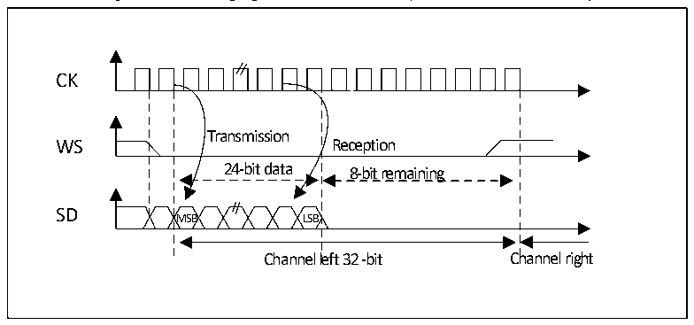
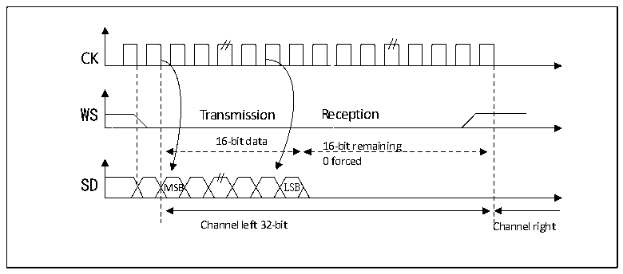

<!-- source-page: 349 -->

[← p.348](0348.md) · [index](../README.md) · [PDF p.349](https://ch32-riscv-ug.github.io/CH32V407/datasheet_en/CH32V407RM.PDF#page=349) · [p.350 →](0350.md)

<!-- header: CH32V407 Reference Manual https://wch-ic.com -->

Figure 20-5 Philips protocol waveform (24-bit frame, CPOL=0)  
 <!-- rendered from the PDF; verify at https://ch32-riscv-ug.github.io/CH32V407/datasheet_en/CH32V407RM.PDF#page=349 -->

🖼 Text parsed from the figure above

Transmission  Reception  24-bit data MSB LSB  8-bit remaining  
CK  
SD  
Channel left 32 -bit Channel right  

This mode requires 2 read or write operations to the SPI_DATAR register. In transmit mode: if you need to  
send 0x8EAA33 (24-bits):  
First write to Data register Second write to Data register  
0x8EAA 0x33XX  
Only the 8 MSB are sent to complete the 24 bits  
8 LSB bit have no meaning and could be  
anything  
In receive mode: if 0x8EAA33 is received:  
First read from Data register Second read from Data register  
0x8EAA 0x3300  
Only the 8MSB are right  
The 8 LSB will always be 00  

Figure 20-6 Philips protocol standard waveforms (16-bit extended to 32-bit packet frame, CPOL=0)  
 <!-- rendered from the PDF; verify at https://ch32-riscv-ug.github.io/CH32V407/datasheet_en/CH32V407RM.PDF#page=349 -->

🖼 Text parsed from the figure above

Transmission  Reception  16-bit data MSB LSB  16-bit remaining 0 forced B  
CK  
SD  
Channel left 32-bit Channel right  

In the I2S configuration stage, if you choose to extend the 16-bit data to a 32-bit channel frame, you only need  
<!-- image: p349-draw-image-00001 bbox=[499.92, 794.16, 519.84, 804.96] -->
<!-- footer: V1.2 347 -->
