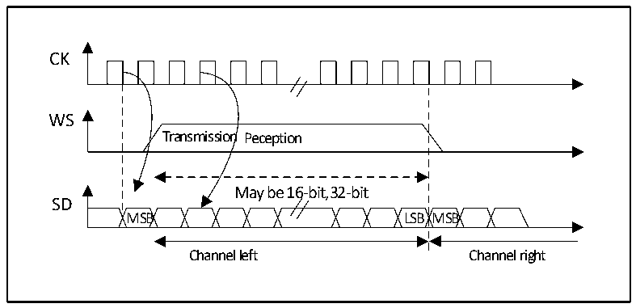
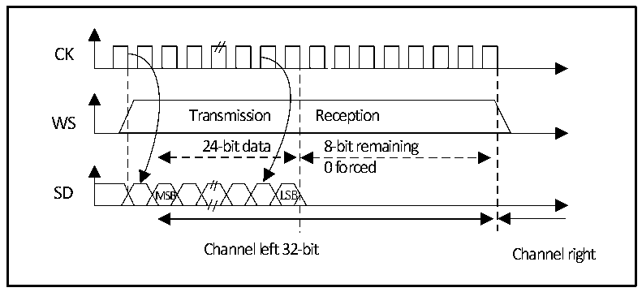

<!-- source-page: 350 -->

[← p.349](0349.md) · [index](../README.md) · [PDF p.350](https://ch32-riscv-ug.github.io/CH32V407/datasheet_en/CH32V407RM.PDF#page=350) · [p.351 →](0351.md)

<!-- header: CH32V407 Reference Manual https://wch-ic.com -->
to access the register DATAR once to extend to 32-bit. The lower 16 bits are set to 0x0000 by hardware. If the  
data to be transmitted or received is 0x76A3 (Extended to 32 bits is 0x76A30000), only one operation of  
DATAR is required. When sending, the MSB needs to be written into the register DATAR; if the flag bit TXE  
is 1, it means that new data can be written, and if the corresponding interrupt is allowed, an interrupt can be  
generated. The transmission is done by hardware, even if the last 16 bits of 0x0000 have not been sent, the  
TXE will be set and the corresponding interrupt will be generated. When receiving, each time the upper 16-  
bit half-word (MSB) is received, the flag bit RXNE is set to 1, and if the corresponding interrupt is enabled,  
an interrupt can be generated. This way, there is more time between the 2 reads and writes, preventing  
underflow or overflow conditions.  

#### 20.3.2.2 MSB alignment standard

Under this standard, the WS signal and the first data bit, the most significant bit (MSB), are generated  
simultaneously.  

Figure 20-7 MSB aligned 16-bit or 32-bit full precision (CPOL = 0)  
 <!-- rendered from the PDF; verify at https://ch32-riscv-ug.github.io/CH32V407/datasheet_en/CH32V407RM.PDF#page=350 -->

🖼 Text parsed from the figure above

CK  
Transmission Peception  
WS  
May be 16-bit,32-bit  
SD  
MSB LSB MSB  
Channel left Channel right  

The sender changes data on the falling edge of the clock signal; the receiver reads data on the rising edge.  

Figure 20-8 MSB aligned 24-bit data, CPOL = 0  
 <!-- rendered from the PDF; verify at https://ch32-riscv-ug.github.io/CH32V407/datasheet_en/CH32V407RM.PDF#page=350 -->

🖼 Text parsed from the figure above

CK  
Transmission Reception  
WS  
24-bit data 8-bit remaining  
0 forced  
SD MSB LSB  
Channel left 32-bit Channel right  

<!-- image: p350-draw-image-00001 bbox=[499.92, 794.16, 519.84, 804.96] -->
<!-- footer: V1.2 348 -->
