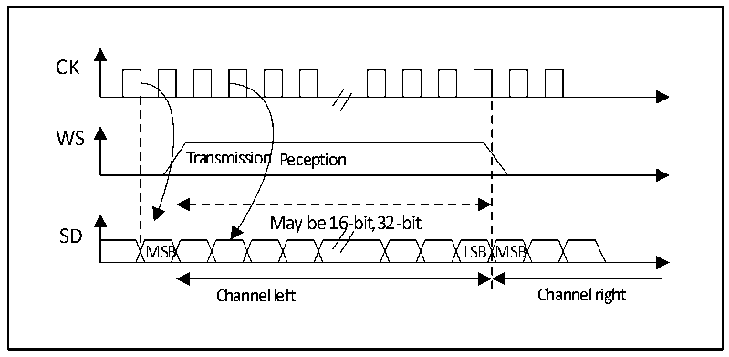
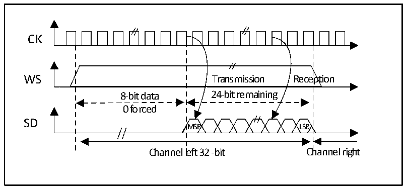

<!-- source-page: 351 -->

[← p.350](0350.md) · [index](../README.md) · [PDF p.351](https://ch32-riscv-ug.github.io/CH32V407/datasheet_en/CH32V407RM.PDF#page=351) · [p.352 →](0352.md)

<!-- header: CH32V407 Reference Manual https://wch-ic.com -->

Figure 20-9 MSB-aligned 16-bit data extended to 32-bit packet frame, CPOL = 0  
 <!-- rendered from the PDF; verify at https://ch32-riscv-ug.github.io/CH32V407/datasheet_en/CH32V407RM.PDF#page=351 -->

🖼 Text parsed from the figure above

CK  
Transmission Reception  
WS  
16-bit data 16-bit remaining  
0 forced  
SD MSB LSB  
Channel left 32-bit Channel right  

#### 20.3.2.3 LSB alignment standard

This standard is similar to the MSB alignment standard (No difference in 16-bit or 32-bit full-precision frame  
format).  

Figure 20-10 LSB-aligned 16- or 32-bit full precision, CPOL = 0  
 <!-- rendered from the PDF; verify at https://ch32-riscv-ug.github.io/CH32V407/datasheet_en/CH32V407RM.PDF#page=351 -->

🖼 Text parsed from the figure above

CK  
WS  
Transmission Peception  
May be 16-bit,32-bit  
SD  
MSB LSB MSB  
Channel left Channel right  

Figure 20-11 LSB-aligned 24-bit data, CPOL = 0  
 <!-- rendered from the PDF; verify at https://ch32-riscv-ug.github.io/CH32V407/datasheet_en/CH32V407RM.PDF#page=351 -->

🖼 Text parsed from the figure above

CK  
WS Transmission Reception  
8-bit data 24-bit remaining  
0 forced  
SD  
MSB LSB  
Channel left 32 -bit Channel right  

In transmit mode, if you want to send data 0x3478AE, you need to write the register DATAR twice by software  
or DMA.  
<!-- image: p351-draw-image-00001 bbox=[499.92, 794.16, 519.84, 804.96] -->
<!-- footer: V1.2 349 -->
