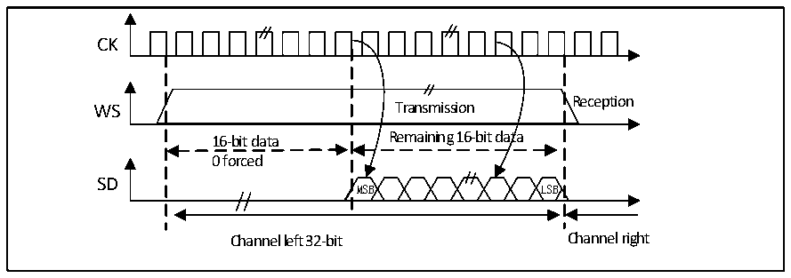

<!-- source-page: 352 -->

[← p.351](0351.md) · [index](../README.md) · [PDF p.352](https://ch32-riscv-ug.github.io/CH32V407/datasheet_en/CH32V407RM.PDF#page=352) · [p.353 →](0353.md)

<!-- header: CH32V407 Reference Manual https://wch-ic.com -->
TEX=&#x27;1 &#x27; when the data register is written TEX=&#x27;1 &#x27; when the data register is written  
for the first time for the second time  
0xXX34 0x78E  
Only the lower 8 bits in the halfword have meaning, the higher 8 bits are forced to  
be set to 0x00  
In receive mode, if you want to receive data 0x3478AE, you need to read the register DATAR once when 2  
consecutive RXNE events occur.  
RXNE=&#x27;1&#x27; when the data register is read out RXNE=&#x27;1&#x27; when the data register is read out  
for the first time for the second time  
0xXX34 0x78E  
Only the lower 8 bits in the halfword have meaning, the higher 8 bits are forced to  
be set to 0x00  

Figure 20-12 LSB aligned 16-bit data extended to 32-bit packet frame, CPOL = 0  
 <!-- rendered from the PDF; verify at https://ch32-riscv-ug.github.io/CH32V407/datasheet_en/CH32V407RM.PDF#page=352 -->

🖼 Text parsed from the figure above

CK  
Reception  
WS Transmission  
16-bit data Remaining 16-bit data  
0 forced  
SD  
MSB LSB  
Channel left 32-bit Channel right  

During the I2S configuration stage, if you choose to extend the 16-bit data to a 32-channel frame, you only  
need to access the DATAR register once. At this point, the high half word (16-bit MSB) after extending to 32  
bits is set to 0x0000 by hardware.  
If the data to be transmitted or received is 0x76A3 (Extended to 32 bits is 0x000076A3), only one operation  
of DATAR is required. When sending, if TXE is 1, the user needs to write the data to be sent (i.e. 0x76A3).  
The 0x0000 part, which is used to extend to 32 bits, is first sent by the hardware, and once the valid data starts  
to be sent from the SD pin, the next TXE event occurs. On reception, the RXNE event occurs as soon as valid  
data is received (Instead of the 0x0000 part). This way, there is more time between the 2 reads and writes,  
preventing underflow or overflow conditions.  

#### 20.3.2.4 PCM standard

Under the PCM standard, there is no information for channel selection. The PCM standard has 2 available  
frame structures, short or long, which can be selected by setting the PCMSYNC bit in register I2SCFGR.  
<!-- image: p352-draw-image-00001 bbox=[499.92, 794.16, 519.84, 804.96] -->
<!-- footer: V1.2 350 -->
