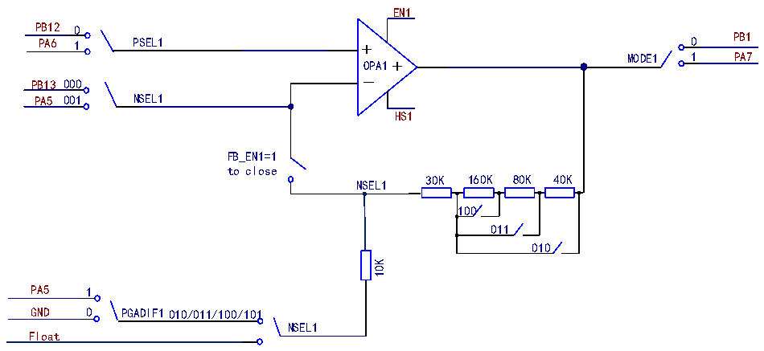

<!-- source-page: 367 -->

[← p.366](0366.md) · [index](../README.md) · [PDF p.367](https://ch32-riscv-ug.github.io/CH32V407/datasheet_en/CH32V407RM.PDF#page=367) · [p.368 →](0368.md)

<!-- header: CH32V407 Reference Manual https://wch-ic.com -->

# Chapter 21 Operational Amplifier (OPA)

Operational amplifier module (OPA), containing 1 independently configurable operational amplifier. The input  
and output of the operational amplifier are connected to the I/O port and are pin-selectable. The operational  
amplifier (OPA or PGA) supports gain selection.  

## 21.1 Main Features

● Input pin selectable  
● Output pin selectable  
● Support programmable gain amplifier (PGA)  

## 21.2 Function Description

In the R32_OPA_CTLR register: set EN1 to enable the corresponding OPA1; configure MODE1 to select the  
output channel of OPA1; configure PSEL1 to select the forward input pin of OPA1; configure NSEL1, you  
can select the negative input channel of OPA1, or the gain when used as a PGA; set FB_EN1 to enable the  
PGA mode of OPA1; set PGADIF1 to enable the differential input PGA mode; set HS1 to enable the high-  
speed mode of OPA1.  

Figure 21-1 OPA structure diagram  
 <!-- rendered from the PDF; verify at https://ch32-riscv-ug.github.io/CH32V407/datasheet_en/CH32V407RM.PDF#page=367 -->

🖼 Text parsed from the figure above

EN1  
PB12  
0  
PB1 PA6  
1 PSEL1 + 0  
_OPA1+ MODE1 1  
PA7  
000  
PB13  
001 NSEL1  
PA5  
HS1  
FB_EN1=1  
to close  
30K 160K 80K 40K  
NSEL1  
100  
011  
010  
10K  
PA5  
1  
GND 010/011/100/101  
0 PGADIF1  
NSEL1  
Float  

## 21.3 Register Description

<!-- p367-table-001 (table-21-1@1) -->
<table><caption>Table 21-1 OPA-related registers</caption><tr><th>Name</th><th>Access address</th><th>Description</th><th>Reset value</th></tr><tr><td>R32_OPA_CTLR</td><td>0x40023804</td><td>OPA control register</td><td>0x00000000</td></tr></table>

### 21.3.1 OPA Control Register (R32_OPA_CTLR)

Offset address: 0x04  

> ⬇ **Bit numbers for the register diagram at the top of [page 368](0368.md)**. <!-- p367-line-00050 -->

<!-- image: p367-draw-image-00001 bbox=[499.92, 794.16, 519.84, 804.96] -->
<!-- footer: V1.2 365 -->
