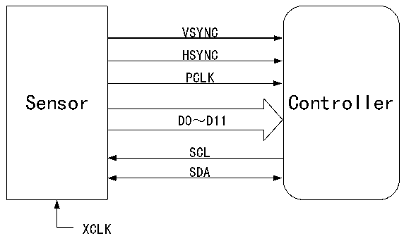

<!-- source-page: 395 -->

[← p.394](0394.md) · [index](../README.md) · [PDF p.395](https://ch32-riscv-ug.github.io/CH32V407/datasheet_en/CH32V407RM.PDF#page=395) · [p.396 →](0396.md)

<!-- header: CH32V407 Reference Manual https://wch-ic.com -->

# Chapter 23 Digital Video Port (DVP)

Digital Video Port (DVP) is used to connect the camera module to obtain the image data stream. 8/10/12-bit  
parallel interface communication is provided, which supports the maximum input frequency of 150MHz pixel  
clock. It supports image data organized in original line and frame formats, such as YUV and RGB, and also  
supports compressed image data in JPEG format, and can receive high-speed parallel data streams output by  
external 8-bit, 10-bit and 12-bit camera modules. When receiving, it mainly depends on the synchronization  
of VSYNC and HSYNC signals. Support image cropping function.  

## 23.1 Main Features

● Configurable 8/10/12-bit data width modes  
● Support YUV and RGB format data  
● Support JPEG compressed format data  
● Built-in FIFO with DMA transfer support  
● Support dual-buffered reception  
● Support cropping functionality  
● Support continuous mode and snapshot mode  

## 23.2 Register Description

### 23.2.1 Connected to the Sensor

Figure 23-1 DVP interface connection  
 <!-- rendered from the PDF; verify at https://ch32-riscv-ug.github.io/CH32V407/datasheet_en/CH32V407RM.PDF#page=395 -->

🖼 Text parsed from the figure above

VSYNC  
HSYNC  
PCLK  
Sensor Controller  
D0～D11  
SCL  
SDA  
XCLK  

● PLCK (Pixel clk): pixel clock, each clock corresponds to single pixel data (Uncompressed data). The  
PCLK clock output by the external DVP interface sensor supports a maximum of 150MHz.  
● HSYNC (Horizontal synchronization): horizontal synchronization signal.  
● VSYNC (Vertical synchronization): Frame synchronization signal.  
● DATA: pixel data or compressed data, the bit width supports 8/10/12 bits.  
● XCLK: The reference clock of the Sensor, which can be provided by the microcontroller or externally,  
generally using a crystal oscillator.  
● I2C interface: The register used to configure the sensor, which can simulate the I2C timing  
communication through the controlled common GPIO port, or use the hardware I2C interface to operate.  
<!-- image: p395-draw-image-00001 bbox=[499.92, 794.16, 519.84, 804.96] -->
<!-- footer: V1.2 393 -->
