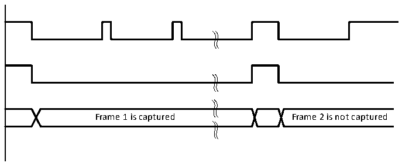
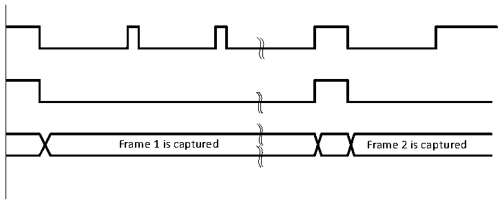

<!-- source-page: 398 -->

[← p.397](0397.md) · [index](../README.md) · [PDF p.398](https://ch32-riscv-ug.github.io/CH32V407/datasheet_en/CH32V407RM.PDF#page=398) · [p.399 →](0399.md)

<!-- header: CH32V407 Reference Manual https://wch-ic.com -->
7） According to the requirements, enable the corresponding interrupt through the R8_DVP_IER register,  
configure the interrupt priority through the interrupt controller NVIC or PFIC, and enable the DVP  
interrupt.  
8） The DMA is enabled through the R8_DVP_CR1 register, and the DVP interface is enabled through the  
R8_DVP_CR0 register.  
9） Wait for the generation of the relevant receiving interrupt, and process the received data in time.  

### 23.3.3 Capture Mode Description

The DVP interface supports 2 capture modes: snapshot (Single frame) mode and continuous mode.  

#### 23.3.3.1 Snapshot Mode

In this mode, only a single frame is captured (RB_DVP_CM is set to 1 in the R8_DVP_CR1 register). When  
the DVP interface is enabled, wait for the system to detect the start of the frame, and then start to sample the  
image data. After receiving a complete frame of data, the DVP interface will be turned off. (The  
RB_DVP_ENABLE field of the R8_DVP_CR0 register is cleared to 0). Figure 29-3 shows the single frame  
capture waveform in snapshot mode.  

Figure 23-3 Single frame capture waveform in Snapshot mode  
 <!-- rendered from the PDF; verify at https://ch32-riscv-ug.github.io/CH32V407/datasheet_en/CH32V407RM.PDF#page=398 -->

🖼 Text parsed from the figure above

Frame 1 is captured Frame 2 is not captured  

#### 23.3.3.2 Continuous Mode

In this mode (RB_DVP_CM is cleared to 0 in the R8_DVP_CR1 register), after the DVP interface is enabled,  
each frame of data will be continuously sampled before the RB_DVP_ENABLE field of the R8_DVP_CR0  
register is cleared to 0. The frame capture waveform in continuous mode is shown in Figure 23-4.  

Figure 23-4 Frame capture waveform in continuous mode  
 <!-- rendered from the PDF; verify at https://ch32-riscv-ug.github.io/CH32V407/datasheet_en/CH32V407RM.PDF#page=398 -->

🖼 Text parsed from the figure above

Frame 1 is captured Frame 2 is captured  

### 23.3.4 Cropping Function Description

DVP can use the crop function to cut a rectangular window from the received image. The starting coordinates  
<!-- image: p398-draw-image-00001 bbox=[499.92, 794.16, 519.84, 804.96] -->
<!-- footer: V1.2 396 -->
