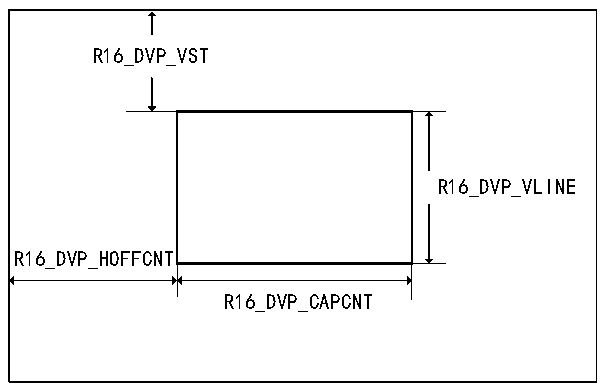
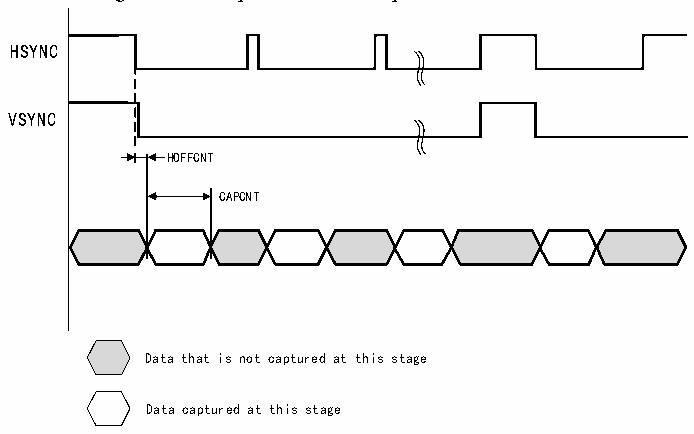

<!-- source-page: 399 -->

[← p.398](0398.md) · [index](../README.md) · [PDF p.399](https://ch32-riscv-ug.github.io/CH32V407/datasheet_en/CH32V407RM.PDF#page=399) · [p.400 →](0400.md)

<!-- header: CH32V407 Reference Manual https://wch-ic.com -->
of the rectangular window (X coordinate of the upper left corner of the rectangle R16_DVP_HOFFCNT, Y  
coordinate R16_DVP_VST) and window size (R16_DVP_CAPCNT represents the horizontal size,  
R16_DVP_VLINE represents the vertical size) are configurable. The coordinates and size of the cropping  
window are shown in Figure 23-5. The cropped window data capture waveform is shown in Figure 23-6.  

Figure 23-5 Crop window coordinates and size  
 <!-- rendered from the PDF; verify at https://ch32-riscv-ug.github.io/CH32V407/datasheet_en/CH32V407RM.PDF#page=399 -->

🖼 Text parsed from the figure above

R16_DVP_VST  
R16_DVP_VLINE  
R16_DVP_HOFFCNT  
R16_DVP_CAPCNT  

Figure 23-6 Crop window data capture waveform  
 <!-- rendered from the PDF; verify at https://ch32-riscv-ug.github.io/CH32V407/datasheet_en/CH32V407RM.PDF#page=399 -->

🖼 Text parsed from the figure above

HSYNC  
VSYNC  
HOFFCNT  
CAPCNT  
Data that is not captured at this stage  
Data captured at this stage  

## 23.4 Register Description

<!-- p399-table-002 (table-23-2@1) pages 399-400 -->
<table><caption>Table 23-2 DVP registers</caption><tr><th>Name</th><th>Access address</th><th>Description</th><th>Reset value</th></tr><tr><td>R8_DVP_CR0</td><td>0x50050000</td><td>DVP control register0</td><td>0x00</td></tr><tr><td>R8_DVP_CR1</td><td>0x50050001</td><td>DVP control register1</td><td>0x06</td></tr><tr><td>R8_DVP_IER</td><td>0x50050002</td><td>DVP interrupt enable register</td><td>0x00</td></tr><tr><td>R16_DVP_ROW_NUM</td><td>0x50050004</td><td>DVP row number configuration register</td><td>0x0000</td></tr><tr><td>R16_DVP_COL_NUM</td><td>0x50050006</td><td>DVP column number configuration register</td><td>0x0000</td></tr><tr><td>R32_DVP_DMA_BUF0</td><td>0x50050008</td><td>DVP DMA address 0 register</td><td>0x00000000</td></tr><tr><td>R32_DVP_DMA_BUF1</td><td>0x5005000C</td><td>DVP DMA address 1 register</td><td>0x00000000</td></tr><tr><td>R8_DVP_IFR</td><td>0x50050010</td><td>DVP interrupt flag register</td><td>0x00</td></tr><tr><td>R8_DVP_STATUS</td><td>0x50050011</td><td>DVP receive FIFO status register</td><td>0x00</td></tr><tr><td>R16_DVP_ROW_CNT</td><td>0x50050014</td><td>DVP row count register</td><td>0x0000</td></tr><tr><td>R16_DVP_HOFFCNT</td><td>0x50050018</td><td style="text-align:left">Horizontal displacement register for the start of the window</td><td>0x0000</td></tr><tr><td>R16_DVP_VST</td><td>0x5005001A</td><td>Window start line number register</td><td>0x0000</td></tr><tr><td>R16_DVP_CAPCNT</td><td>0x5005001C</td><td>DVP capture count register</td><td>0x0000</td></tr><tr><td>R16_DVP_VLINE</td><td>0x5005001E</td><td>DVP vertical line count register</td><td>0x0000</td></tr><tr><td>R32_DVP_DR</td><td>0x50050020</td><td>DVP data register</td><td>0x00000000</td></tr></table>

<!-- image: p399-draw-image-00001 bbox=[499.92, 794.16, 519.84, 804.96] -->
<!-- footer: V1.2 397 -->
