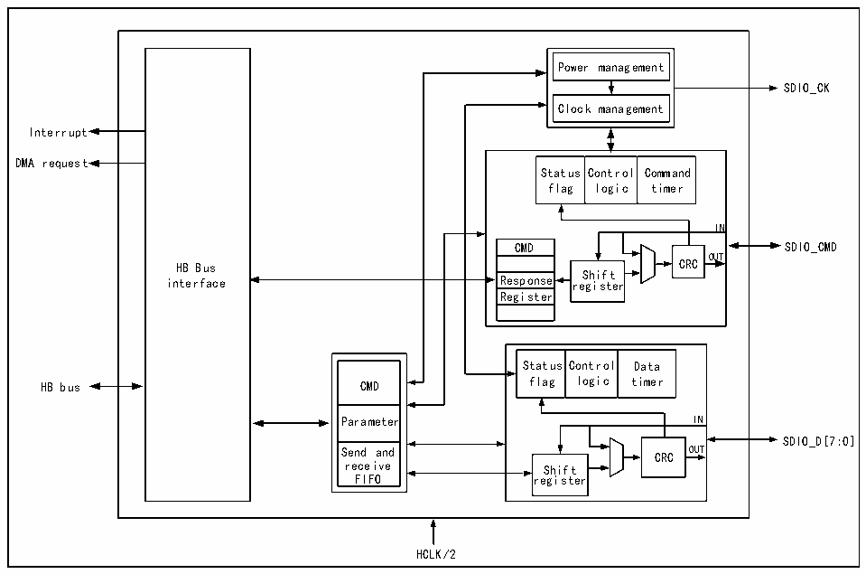

<!-- source-page: 406 -->

[← p.405](0405.md) · [index](../README.md) · [PDF p.406](https://ch32-riscv-ug.github.io/CH32V407/datasheet_en/CH32V407RM.PDF#page=406) · [p.407 →](0407.md)

<!-- header: CH32V407 Reference Manual https://wch-ic.com -->
SDIO_CK, SDIO_CMD, SDIO_D[7:0], which are connected to SDIO devices through several pins. SDIO is  
a host-dominated communication interface, and all transfers must be initiated by the microcontroller.  

### 24.2.1 Peripheral Structure

The structure of SDIO is shown in Figure 24-1.  

Figure 24-1 SDIO structure diagram  
 <!-- rendered from the PDF; verify at https://ch32-riscv-ug.github.io/CH32V407/datasheet_en/CH32V407RM.PDF#page=406 -->

🖼 Text parsed from the figure above

Power management  
SDIO_CK  
Clock management  
Interrupt  
DMA request  
Status flag  Control logic  Command timer  
IN  
CMD  Respons  Respons  Registe  
CMD SDIO_CMD  
HB Bus CRC OUT  
interface Response re S g h i i s f t t e r  
Register  
Status flag  Control logic  Data timer  
CMD  Parameter  Send and receive FIFO  
Parameter IN  
SDIO_D[7:0]  
Send and CRC OUT  
receive Shift  
FIFO register  
HCLK/2  

SDIO is a peripheral that the microcontroller directly operates the SDIO device as a host. It is roughly  
composed of 5 modules: HB interface, clock control part, CMD line control part, data line control part and  
control register part. SDIO is a half-duplex for peripherals, the CPU writes the commands and data to be sent  
to the control register, and the command line and data line control module is responsible for pushing the  
command or data to the IO and adding CRC. The data flow of SDIO is responsible for the transfer from RAM  
to SDIO FIFO by general-purpose DMA. SDIO FIFO has 32×32-bit sizes.  

### 24.2.2 Pins and Configuration

The pins that need to be configured for SDIO and their modes are shown in Table 24-1.  

<!-- p406-table-005 (table-24-1@1) pages 406-407 -->
<table><caption>Table 24-1 SDIO pin configuration</caption><tr><th style="text-align:left">SDIO alternate function</th><th style="text-align:left">The pin mode that needs to be configured</th><th style="text-align:left">The pin speed that needs to be configured</th></tr><tr><td>SDIO_D[0:3]</td><td>Push-pull alternate output</td><td>50MHz</td></tr><tr><td>SDIO_CK</td><td>Push-pull alternate output</td><td>50MHz</td></tr><tr><td>SDIO_CMD</td><td>Push-pull alternate output</td><td>50MHz</td></tr><tr><td>SDIO_D4</td><td>Push-pull alternate output</td><td>50MHz</td></tr><tr><td>SDIO_D5</td><td>Push-pull alternate output</td><td>50MHz</td></tr><tr><td>SDIO_D6</td><td>Push-pull alternate output</td><td>50MHz</td></tr><tr><td>SDIO_D7</td><td>Push-pull alternate output</td><td>50MHz</td></tr></table>

<!-- image: p406-draw-image-00001 bbox=[499.92, 794.16, 519.84, 804.96] -->
<!-- footer: V1.2 404 -->
