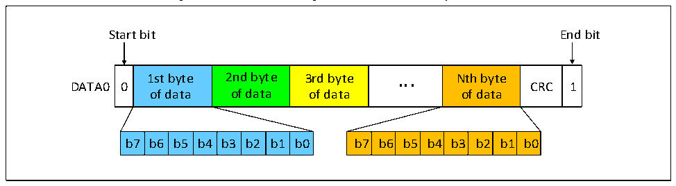
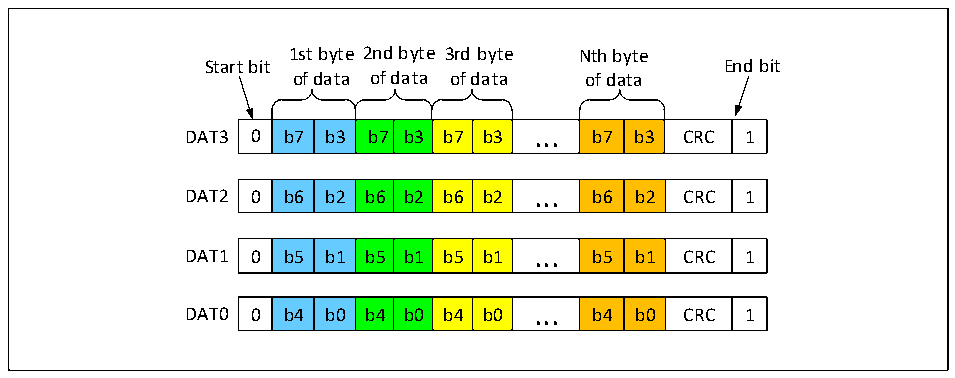
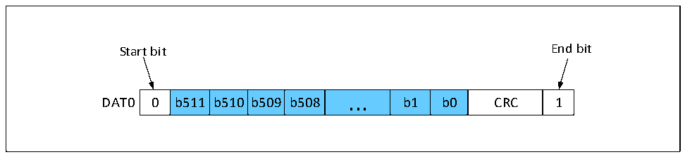

<!-- source-page: 416 -->

[← p.415](0415.md) · [index](../README.md) · [PDF p.416](https://ch32-riscv-ug.github.io/CH32V407/datasheet_en/CH32V407RM.PDF#page=416) · [p.417 →](0417.md)

<!-- header: CH32V407 Reference Manual https://wch-ic.com -->
back. For the block transfer mode only supported by the SD card, the data transfer of each block is followed  
by a CRC.  
Enable the RANDOM_LEN_EN bit, configure the byte length indicated by DBLOCKSIZE2, configure the  
total length of the transferred data indicated by R32_SDIO_DLEN, enable the DTEN bit, and fill in the data  
to the R32_SDIO_FIFO, then you can complete the transfer of the block of any byte length with CRC  
checksum.  
The MMC card also supports the data streaming transfer mode, at this time no CRC is attached. the following  
figure shows the format of the data transfer.  

Figure 24-9 SD card single bus data transfer byte format  
 <!-- rendered from the PDF; verify at https://ch32-riscv-ug.github.io/CH32V407/datasheet_en/CH32V407RM.PDF#page=416 -->

🖼 Text parsed from the figure above

Start bit End bit  
0  1st byte of data  2nd byte of data  3rd byte of data  ...  Nth byte of data  CRC  1  b7  b6  b5  b4  b3  b2  b1  b0  b7  b6  b5  b4  b3  b2  b1  b0  

Figure 24-10 SD card 4 bus data transfer byte format  
 <!-- rendered from the PDF; verify at https://ch32-riscv-ug.github.io/CH32V407/datasheet_en/CH32V407RM.PDF#page=416 -->

🖼 Text parsed from the figure above

1st byte 2nd byte 3rd byte Nth byte  
Start bit End bit  
of data of data of data of data  
0  b7  b3  b7  b3  b7  b3  ...  b7  b3  CRC  1  
0  b6  b2  b6  b2  b6  b2  ...  b6  b2  CRC  1  
0  b5  b1  b5  b1  b5  b1  ...  b5  b1  CRC  1  
0  b4  b0  b4  b0  b4  b0  ...  b4  b0  CRC  1  

Figure 24-11 SD card single bus data transfer in a 512-bit word format  
 <!-- rendered from the PDF; verify at https://ch32-riscv-ug.github.io/CH32V407/datasheet_en/CH32V407RM.PDF#page=416 -->

🖼 Text parsed from the figure above

Start bit End bit  
0  b511  b510  b509  b508  ...  b1  b0  CRC  1  

<!-- image: p416-draw-image-00001 bbox=[499.92, 794.16, 519.84, 804.96] -->
<!-- footer: V1.2 414 -->
