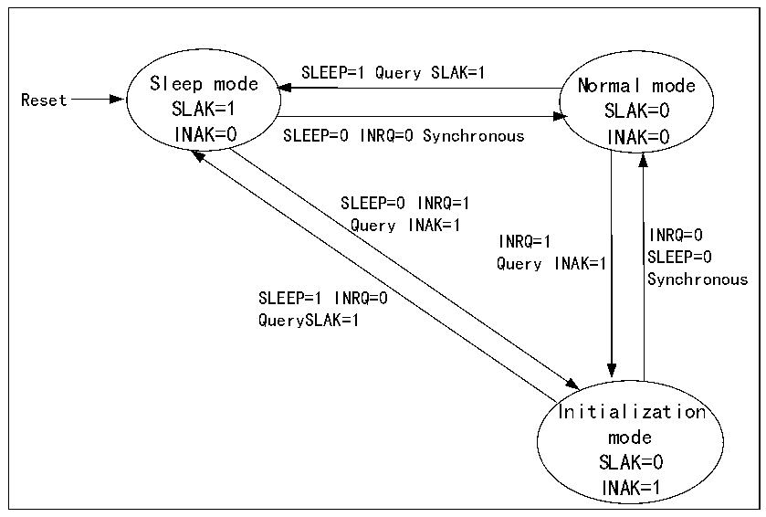

<!-- source-page: 434 -->

[← p.433](0433.md) · [index](../README.md) · [PDF p.434](https://ch32-riscv-ug.github.io/CH32V407/datasheet_en/CH32V407RM.PDF#page=434) · [p.435 →](0435.md)

<!-- header: CH32V407 Reference Manual https://wch-ic.com -->
state.  
To enter the normal mode from sleep mode, the SLEEP bit of CAN1_CTLR must be cleared 0, and when the  
SNAK bit of register CAN1_STATR is automatically cleared 0, it will enter normal mode.  

Figure 25-1 CAN operating mode switch  
 <!-- rendered from the PDF; verify at https://ch32-riscv-ug.github.io/CH32V407/datasheet_en/CH32V407RM.PDF#page=434 -->

🖼 Text parsed from the figure above

SLEEP=1 Query SLAK=1  
Sleep mode Normal mode  
Reset  
SLAK=1 SLAK=0  
INAK=0 SLEEP=0 INRQ=0 Synchronous INAK=0  
SLEEP=0 INRQ=1  
Query INAK=1  
INRQ=0  
INRQ=1  
SLEEP=0  
Query INAK=1  
Synchronous  
SLEEP=1 INRQ=0  
QuerySLAK=1  
Initialization  
mode  
SLAK=0  
INAK=1  

## 25.3 CAN Controller Test Mode

In the initialization mode, operate the SILM and LBKM bits of the register CAN1_BTIMR to select a test  
mode, and then exit the initialization mode and enter the test mode by clearing the INRQ bit of the register  
CAN1_CTLR. There are 3 test modes: silent mode, loopback mode and silent loopback mode.  

### 25.3.1 Silent Mode

Setting the SILM bit in register CAN1_BTIMR to 1 can optionally enter silent mode. In this mode, the CAN  
controller can receive, but cannot send messages to the outside world. It is always in a recessive bit to the  
outside world, which can avoid affecting the bus, but the message can be received by the controller of the node  
where it is located. Usually, silent mode is used for the status analysis of the CAN bus.  

### 25.3.2 Loopback Mode

By setting the LBKM bit of the register CAN1_BTIMR to 1, the loopback mode can be selected. In this mode,  
the CAN controller can send external messages, but cannot receive external messages, but the sent messages  
can be received by the controller of the node where it is located, and the reception filtering mechanism is  
effective. Usually, loopback mode is used for transceiver testing of CAN controllers.  

### 25.3.3 Silent Loopback Mode

Setting the SILM and LBKM bits in register CAN1_BTIMR to 1 can optionally enter silent loopback mode.  
This mode is usually used for the closed self-test of the CAN controller. In this mode, it has no effect on the  
CAN bus, the RX pin is disconnected from the bus, and the TX pin is set to a recessive bit.  
<!-- image: p434-draw-image-00001 bbox=[499.92, 794.16, 519.84, 804.96] -->
<!-- footer: V1.2 432 -->
