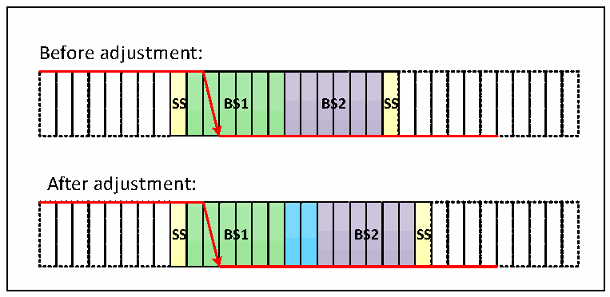
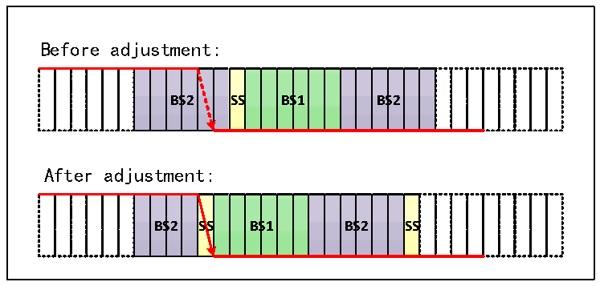

<!-- source-page: 441 -->

[← p.440](0440.md) · [index](../README.md) · [PDF p.441](https://ch32-riscv-ug.github.io/CH32V407/datasheet_en/CH32V407RM.PDF#page=441) · [p.442 →](0442.md)

<!-- header: CH32V407 Reference Manual https://wch-ic.com -->
end of the time period is the location of the sampling point.  
● Time period 2 (BS2): phase buffer section 2 in the CAN standard can be set to 1 to 8 minimum time units  
and can be automatically shortened to compensate for the negative phase drift caused by frequency  
accuracy errors of different nodes on the CAN bus.  
Resynchronization jump width (SJW) is the upper limit of the minimum number of time units that can be  
extended and reduced per person, and the range can be set to 1 to 4 minimum time units.  
The above parameters can be configured in the CAN bus timing register CAN1_BTIMR.  

Figure 25-7 The jump appears in BS1  
 <!-- rendered from the PDF; verify at https://ch32-riscv-ug.github.io/CH32V407/datasheet_en/CH32V407RM.PDF#page=441 -->

🖼 Text parsed from the figure above

Before adjustment:  
<strong>SS BS1 BS2 SS</strong>  
After adjustment:  
<strong>SS BS1 BS2 SS</strong>  

If the SJW of figure 25-7 is 2, and the bus level jump is detected in time period 1, the length of time period 1  
needs to be extended, with a maximum extension of SJW, thus delaying the position of the sampling point.  

Figure 25-8 The jump appears in BS2  
 <!-- rendered from the PDF; verify at https://ch32-riscv-ug.github.io/CH32V407/datasheet_en/CH32V407RM.PDF#page=441 -->

🖼 Text parsed from the figure above

Before adjustment:  
<strong>BS2 SS BS1 BS2</strong>  
After adjustment:  
<strong>BS2 SS BS1 BS2 SS</strong>  

If the SJW of figure 25-8 is 2 and the bus level jump is detected in time period 2, it is necessary to reduce the  
length of time period 2 and the maximum SJW, so as to advance the position of the sampling point.  

## 25.6 CAN Interrupt

The CAN controller has 4 interrupt vectors, which are send interrupt, FIFO_0 interrupt, FIFO_1 interrupt,  
error and state change interrupt.  
Set the CAN interrupt allow register CAN1_INTENR to allow or disable each interrupt source.  
The sending interrupt is caused by the sending mailbox empty event. After the interrupt is generated, the  
<!-- image: p441-draw-image-00001 bbox=[499.92, 794.16, 519.84, 804.96] -->
<!-- footer: V1.2 439 -->
