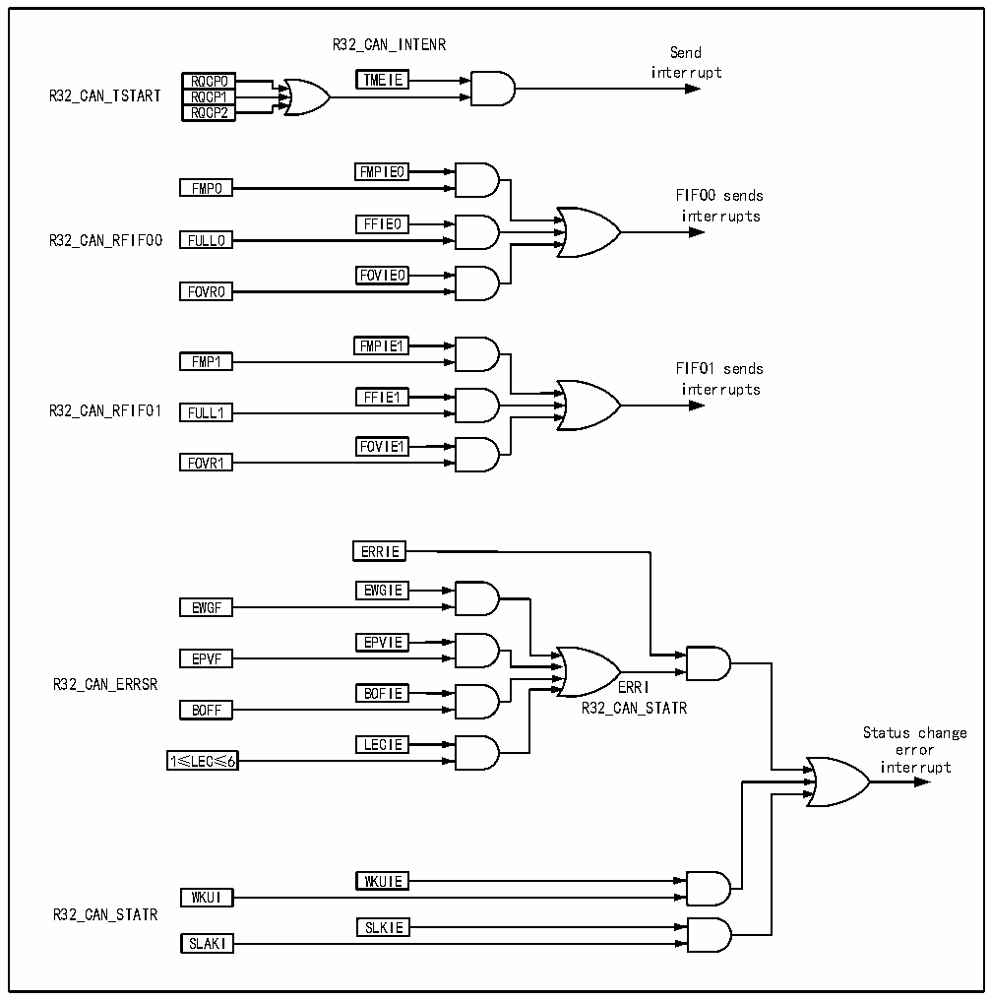

<!-- source-page: 442 -->

[← p.441](0441.md) · [index](../README.md) · [PDF p.442](https://ch32-riscv-ug.github.io/CH32V407/datasheet_en/CH32V407RM.PDF#page=442) · [p.443 →](0443.md)

<!-- header: CH32V407 Reference Manual https://wch-ic.com -->
RQCP0, RQCP1 and RQCP2 bits of the register CAN1_TSTATR are queried to determine which mailbox  
empty event is generated.  
FIFO0 interrupts are caused by receiving new messages, receiving mailbox fullness and overflow events. After  
the interrupts are generated, the FMP0, FULL0 and FOVER0 bits of register CAN1_RFIFO0 are queried to  
determine which mailbox emptiness event is generated.  
FIFO1 interrupts are caused by receiving new messages, receiving mailbox fullness and overflow events. After  
the interrupts are generated, the FMP1, FULL1 and FOVER1 bits of register CAN1_RFIFO1 are queried to  
determine which mailbox emptiness event is generated.  
Errors and state change interruptions are caused by errors, arousal, and sleep events.  

Figure 25-9 CAN interrupt logic diagram  
 <!-- rendered from the PDF; verify at https://ch32-riscv-ug.github.io/CH32V407/datasheet_en/CH32V407RM.PDF#page=442 -->

🖼 Text parsed from the figure above

R32_CAN_INTENR  
Send  
interrupt  
RQCP0 TMEIE  
RQCP0RQCP1  RQCP1RQCP2  
R32_CAN_TSTART RQCP1  
FMPIE0  
FMP0 FIFO0 sends  
interrupts  
FFIE0  
R32_CAN_RFIF00 FULL0  
FOVIE0  
FOVR0  
FMPIE1  
FMP1 FIFO1 sends  
interrupts  
FFIE1  
R32_CAN_RFIF01 FULL1  
FOVIE1  
FOVR1  
ERRIE  
EWGIE  
EWGF  
<!-- image: p442-draw-image-00003 inside the figure -->
EPVIE  
EPVF  
<!-- image: p442-draw-image-00002 inside the figure -->
R32_CAN_ERRSR ERRI  
<!-- image: p442-draw-image-00004 inside the figure -->
BOFIE  
<!-- image: p442-draw-image-00005 inside the figure -->
BOFF R32_CAN_STATR  
Status change  
LECIE  
LECIE error  
1≤LEC≤6 interrupt  
WKUIE  
WKUI  
R32_CAN_STATR  
SLKIE  
SLAKI  

<!-- image: p442-draw-image-00001 bbox=[499.92, 794.16, 519.84, 804.96] -->
<!-- footer: V1.2 440 -->
