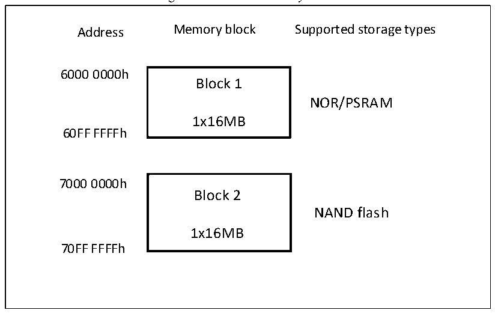

<!-- source-page: 463 -->

[← p.462](0462.md) · [index](../README.md) · [PDF p.463](https://ch32-riscv-ug.github.io/CH32V407/datasheet_en/CH32V407RM.PDF#page=463) · [p.464 →](0464.md)

<!-- header: CH32V407 Reference Manual https://wch-ic.com -->

### 26.2.2 External Device Address Mapping

The FSMC divides the memory block into 2 memory blocks with a fixed size of 16MByte according to the  
address line, as shown in Figure 26-2.  

Figure 26-2 FSMC memory block  
 <!-- rendered from the PDF; verify at https://ch32-riscv-ug.github.io/CH32V407/datasheet_en/CH32V407RM.PDF#page=463 -->

🖼 Text parsed from the figure above

Address Memory block Supported storage types  
6000 0000h  
Block 1  
NOR/PSRAM  
1x16MB  
60FF FFFFh  
7000 0000h  
Block 2  
NAND flash  
1x16MB  
70FF FFFFh  

#### 26.2.2.1 NOR/PSRAM Address Mapping

<!-- p463-table-001 (table-26-1@1) -->
<table><caption>Table 26-1 External memory address</caption><tr><th>Data width</th><th>Address lines connected to memory</th><th style="text-align:left">Maximum access memory space (bit)</th></tr><tr><td>8bit</td><td style="text-align:left">HADDR[23:0] is correspondingly connected to FSMC_A[23:0]</td><td>16MB×8=128Mbit</td></tr><tr><td>16bit</td><td style="text-align:left">HADDR[23:1] is correspondingly connected to FSMC_A[22:0], HADDR[0] is not connected</td><td>16MB/2×16=128Mbit</td></tr></table>

<em>Note: Those with 100 pins support FSMC, and only support address and data line multiplexing mode.</em>  
NOR FLASH and PSRAM support unaligned access. For asynchronous mode, each operation requires an  
accurate address; for synchronous mode, only single address signal is issued, and then batches of data are  
sequentially processed through CLK. For NOR FLASH that supports unaligned batch access, the unaligned  
access mode of the memory can be set to the same mode as HB. If it cannot be set, the unaligned access mode  
is disabled, and the unaligned access request is divided into 2 consecutive access operations.  

#### 26.2.2.2 NAND Address Mapping

NAND FLASH image and timing registers, see Table 26-2.  

<!-- p463-table-002 (table-26-2@1) pages 463-464 -->
<table><caption>Table 26-2 Memory map and timing registers</caption><tr><th>Start address</th><th>End address</th><th>FSMC memory block</th><th>Storage</th><th>Timing register</th></tr><tr><td>0x78000000</td><td>0x78FFFFFF</td><td>Block 2-NAND</td><td>Attribute</td><td>FSMC_PATT2(0x6C)</td></tr><tr><td>0x70000000</td><td>0x70FFFFFF</td><td>FLASH</td><td>General</td><td>FSMC_PMEM2(0x68)</td></tr></table>

<!-- image: p463-draw-image-00001 bbox=[499.92, 794.16, 519.84, 804.96] -->
<!-- footer: V1.2 461 -->
