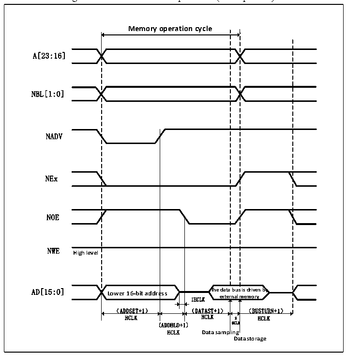

<!-- source-page: 468 -->

[← p.467](0467.md) · [index](../README.md) · [PDF p.468](https://ch32-riscv-ug.github.io/CH32V407/datasheet_en/CH32V407RM.PDF#page=468) · [p.469 →](0469.md)

<!-- header: CH32V407 Reference Manual https://wch-ic.com -->

> ⬆ **Table continued** — rendered in full at [page 467](0467.md). <!-- p468-table-001 -->

Figure 26-5 Mode A read operation (Multiplexed)  
 <!-- rendered from the PDF; verify at https://ch32-riscv-ug.github.io/CH32V407/datasheet_en/CH32V407RM.PDF#page=468 -->

🖼 Text parsed from the figure above

<strong>Memory operation cycle</strong>  
Lower 16-bit addre （ADDSET+1）  ess  
A[23:16]  
NBL[1:0]  
NADV  
NEx  
NOE  
NWE  
<strong>High level</strong>  
<strong>1HCLK external memory</strong>  
HCLK HCLK 2 HCLK  
(ADDHLD+1) HCLK  
<strong>HCLK Data sampling</strong>  
<strong>Data storage</strong>  

<!-- image: p468-draw-image-00001 bbox=[499.92, 794.16, 519.84, 804.96] -->
<!-- footer: V1.2 466 -->
