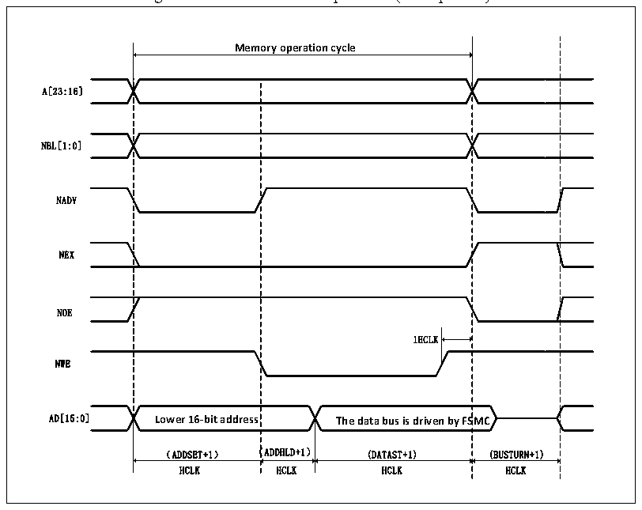

<!-- source-page: 469 -->

[← p.468](0468.md) · [index](../README.md) · [PDF p.469](https://ch32-riscv-ug.github.io/CH32V407/datasheet_en/CH32V407RM.PDF#page=469) · [p.470 →](0470.md)

<!-- header: CH32V407 Reference Manual https://wch-ic.com -->

Figure 26-6 Mode A write operation (Multiplexed)  
 <!-- rendered from the PDF; verify at https://ch32-riscv-ug.github.io/CH32V407/datasheet_en/CH32V407RM.PDF#page=469 -->

🖼 Text parsed from the figure above

<strong>Memory operation cycle</strong>  
Memory operation cycle 1HCLK Lower 16-bit address The data bus is driven by FS （ADDSET+1） （ADDHLD+1） (DATAST+1)  Lower 16-bit address （ADDSET+1） （  SMC (BUSTURN+1)  
A[23:16]  
NBL[1:0]  
NADV  
NEX  
NOE  
NWE  
HCLK HCLK HCLK HCLK  

<!-- p469-table-002 (table-26-10@1) -->
<table><caption>Table 26-10 Mode A FSMC_BCR1 bit field</caption><tr><th>Bitx</th><th>Name</th><th>Configuration Value</th></tr><tr><td>[31:20]</td><td>Reserved</td><td>0x000</td></tr><tr><td>19</td><td>CBURSTRW</td><td>0x0</td></tr><tr><td>[18:16]</td><td>Reserved</td><td>0x0</td></tr><tr><td>15</td><td>ASYNCWAIT</td><td style="text-align:left">It is 1 if the memory supports this function, otherwise it is 0.</td></tr><tr><td>14</td><td>EXTMOD</td><td>0x1</td></tr><tr><td>13</td><td>WAITEN</td><td>0x0</td></tr><tr><td>12</td><td>WREN</td><td>Set as needed</td></tr><tr><td>11</td><td>WAITCFG</td><td>No effect</td></tr><tr><td>10</td><td>Reserved</td><td>0x0</td></tr><tr><td>9</td><td>WAITPOL</td><td>When bit15 is 1, it is meaningful</td></tr><tr><td>8</td><td>BURSTEN</td><td>0x0</td></tr><tr><td>7</td><td>Reserved</td><td>0x1</td></tr><tr><td>6</td><td>FACCEN</td><td>No effect</td></tr><tr><td>[5:4]</td><td>MWID</td><td>Set as needed</td></tr><tr><td>[3:2]</td><td>MTYP</td><td>Set as needed, excluding 0x2 (NOR FLASH)</td></tr><tr><td>1</td><td>MUXEN</td><td>0x1</td></tr><tr><td>0</td><td>MBKEN</td><td>0x1</td></tr></table>

<!-- image: p469-draw-image-00001 bbox=[499.92, 794.16, 519.84, 804.96] -->
<!-- footer: V1.2 467 -->
