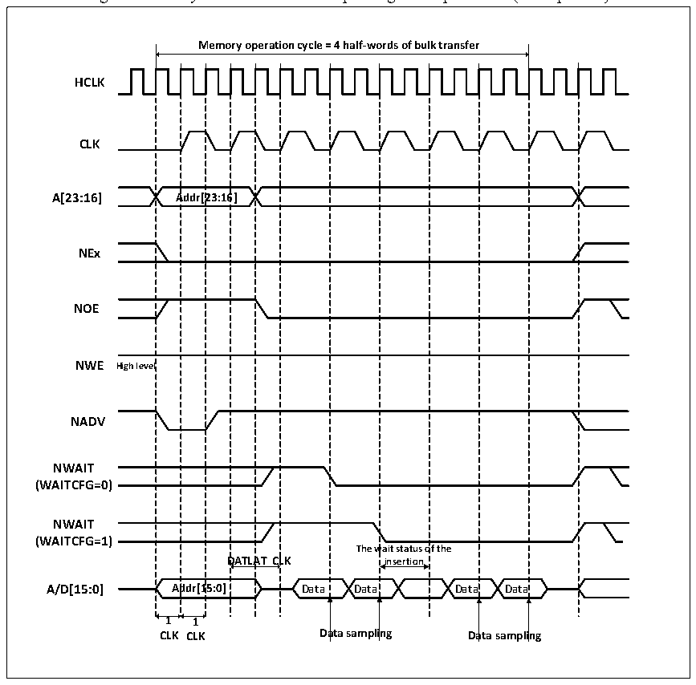

<!-- source-page: 478 -->

[← p.477](0477.md) · [index](../README.md) · [PDF p.478](https://ch32-riscv-ug.github.io/CH32V407/datasheet_en/CH32V407RM.PDF#page=478) · [p.479 →](0479.md)

<!-- header: CH32V407 Reference Manual https://wch-ic.com -->

Figure 26-13 Synchronous bus multiplexing read operations (Multiplexed)  
 <!-- rendered from the PDF; verify at https://ch32-riscv-ug.github.io/CH32V407/datasheet_en/CH32V407RM.PDF#page=478 -->

🖼 Text parsed from the figure above

<strong>Memory operation cycle = 4 half-words of bulk transfer</strong>  
Addr[23:16]  A  Addr[2  23:16  wait status o insertion  AT CL  Ad 1  D  DATLA  DATLA  ddr[1  5:0]  1  
<strong>HCLK</strong>  
<strong>CLK</strong>  
<strong>A[23:16] Addr[23:16]</strong>  
<strong>NEx</strong>  
<strong>NOE</strong>  
<strong>NWE High level</strong>  
<strong>NADV</strong>  
<strong>NWAIT</strong>  
<strong>(WAITCFG=0)</strong>  
<strong>NWAIT</strong>  
<strong>(WAITCFG=1)</strong>  
<strong>1 1</strong>  
<strong>CLK CLK Data sampling Data sampling</strong>  

<!-- p478-table-002 (table-26-22@1) pages 478-479 -->
<table><caption>Table 26-22 FSMC_BCR1 bit field (Synchronous read mode)</caption><tr><th>Bitx</th><th>Name</th><th>Configuration Value</th></tr><tr><td>[31:20]</td><td>Reserved</td><td>0x000</td></tr><tr><td>19</td><td>CBURSTRW</td><td>No effect</td></tr><tr><td>[18:16]</td><td>Reserved</td><td>0x0</td></tr><tr><td>15</td><td>ASYNCWAIT</td><td>0x0</td></tr><tr><td>14</td><td>EXTMOD</td><td>0x0</td></tr><tr><td>13</td><td>WAITEN</td><td>0x0</td></tr><tr><td>12</td><td>WREN</td><td>No effect</td></tr><tr><td>11</td><td>WAITCFG</td><td>Set as needed</td></tr><tr><td>10</td><td>Reserved</td><td>0x0</td></tr><tr><td>9</td><td>WAITPOL</td><td>Set as needed</td></tr><tr><td>8</td><td>BURSTEN</td><td>0x1</td></tr><tr><td>7</td><td>Reserved</td><td>0x1</td></tr><tr><td>6</td><td>FACCEN</td><td>Set as needed</td></tr><tr><td>[5:4]</td><td>MWID</td><td>Set as needed</td></tr><tr><td>[3:2]</td><td>MTYP</td><td>0x1or 0x2</td></tr><tr><td>1</td><td>MUXEN</td><td>0x1</td></tr><tr><td>0</td><td>MBKEN</td><td>0x1</td></tr></table>

<!-- image: p478-draw-image-00001 bbox=[499.92, 794.16, 519.84, 804.96] -->
<!-- footer: V1.2 476 -->
