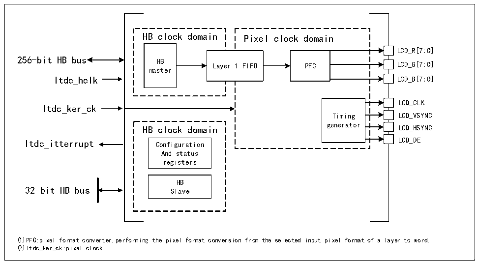

<!-- source-page: 493 -->

[← p.492](0492.md) · [index](../README.md) · [PDF p.493](https://ch32-riscv-ug.github.io/CH32V407/datasheet_en/CH32V407RM.PDF#page=493) · [p.494 →](0494.md)

<!-- header: CH32V407 Reference Manual https://wch-ic.com -->

# Chapter 27 LCD-TFT Display Controller (LTDC)

LCD-TFT (Thin Film Transistor-Liquid Crystal Display) Display Controller (LTDC) mainly provides parallel  
digital RGB, horizontal synchronization, vertical synchronization, pixel clock and data enable signals, which can  
be used as output signals to interface with different LCD and TFT panels.  

## 27.1 Main Features

● Provide 1 display layers, each containing a proprietary 8*32 bits FIFO  
● Support color lookup tables (CLUT) with up to 256 colors per layer  
● Support programmable timing for different display panels  
● Support programmable background color  
● Support programmable polarity for HSYNC, VSYNC, and data enable signals  
● Each display layer supports up to 8 input colors  
● Support programmable window position and size  
● Support thin-film transistor (TFT) color displays  
● Support up to 3 programmable interrupt timers  

## 27.2 Overview

Figure 27-1 Structural block diagram of LTDC  
 <!-- rendered from the PDF; verify at https://ch32-riscv-ug.github.io/CH32V407/datasheet_en/CH32V407RM.PDF#page=493 -->

🖼 Text parsed from the figure above

HB clock domain Pixel clock domain  
LCD_R[7:0]  
Lay  er  1 FIFO  
PFC  
256-bit HB bus HB  
master  
Itdc_hclk LCD_B[7:0]  
LCD_CLK  
Itdc_ker_ck  
Timing LCD_VSYNC  
HB clock domain generator LCD_HSYNC  
Itdc_itterrupt Configuration LCD_DE  
And status  
registers  
HB  
32-bit HB bus Slave  
(1)PFC:pixel format converter,performing the pixel format conversion from the selected input pixel format of a layer to word.  
(2)Itdc_ker_ck:pixel clock.  

## 27.3 Function Description

### 27.3.1 LTDC Synchronization Timing

The LTDC interface is a synchronous data interface comprising pixel clock, pixel data, and horizontal and vertical  
sync signals. Figure 27-2 illustrates the configurable timing parameters generated by the LTDC synchronous timing  
<!-- image: p493-draw-image-00001 bbox=[506.4, 782.88, 526.32, 793.68] -->
<!-- footer: V1.2 491 -->
