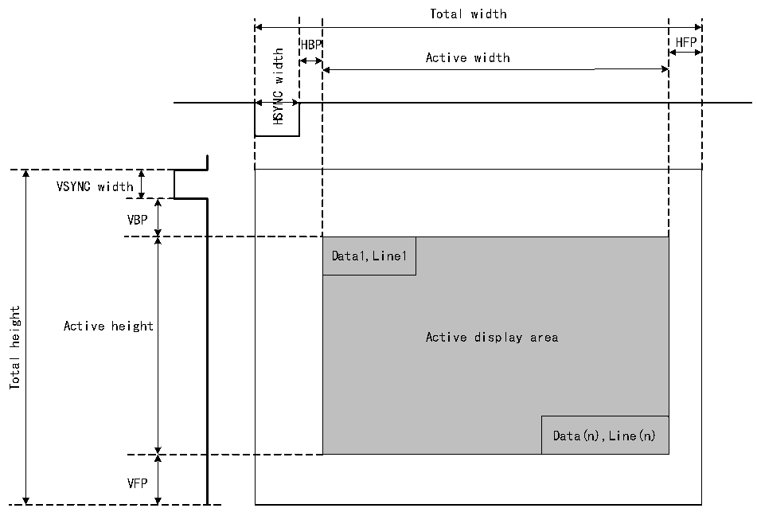

<!-- source-page: 494 -->

[← p.493](0493.md) · [index](../README.md) · [PDF p.494](https://ch32-riscv-ug.github.io/CH32V407/datasheet_en/CH32V407RM.PDF#page=494) · [p.495 →](0495.md)

<!-- header: CH32V407 Reference Manual https://wch-ic.com -->
generator module.  

Figure 27-2 LTDC synchronization timing  
 <!-- rendered from the PDF; verify at https://ch32-riscv-ug.github.io/CH32V407/datasheet_en/CH32V407RM.PDF#page=494 -->

🖼 Text parsed from the figure above

Total width  
HBP  Active width  Data1,Line1  
VSYNC width  
VBP  
height  
Active height  
Total  
VFP  

<em>Note: (1) HSYNC and VSYNC denote horizontal and vertical sync widths, respectively; HBP and HFP denote</em>  
<em>horizontal back-edge period and horizontal front-edge period, respectively; VBP and VFP denote vertical back-</em>  
<em>edge period and vertical front-edge period, respectively.</em>  
- <em>(2) When LTDC is enabled, the generated timing uses the X/Y=0/0 position as the first horizontal sync pixel</em>
<em>within the vertical sync region, followed by the back edge, active data display region, and front edge.</em>  
- <em>(3) When LTDC is disabled, the timing generator module resets to X=total width-1 and Y=total height-1,</em>
<em>holding the previous pixel during the vertical sync phase and before FIFO refresh. Consequently, only blanking</em>  
<em>data is continuously output.</em>  
An example of synchronization timing configuration is as follows:  
1) LCD-TFT timing (to be extracted from the panel datasheet);  
2) Horizontal and vertical sync width: 0xA pixels, 0x2 lines;  
3) Horizontal and vertical trailing edge: 0x14 pixels, 0x2 lines;  
4) Effective width and effective height: 0x140 pixels, 0xF0 lines (320×240);  
5) Horizontal leading edge: 0xA pixels;  
6) Vertical leading edge: 0x4 lines;  
The value programmed in the LTDC timing register will be:  
1) R32_LTDC_SSCR register: Program to 0x00090001. (HSW[11:0] is 0x9 and VSH[10:0] is 0x1);  
2) R32_LTDC_BPCR register: Program to 0x001D0003. (AHBP[11:0] is 0x1D (0xA + 0x13), and AVBP[10:0] is  
0x3 (0x2 + 0x1));  
3) R32_LTDC_AWCR register: Program to 0x015D00F3; (AAW[11:0] is 0x15D (0xA + 0x14 + 0x13F), and  
<!-- image: p494-draw-image-00001 bbox=[506.4, 782.88, 526.32, 793.68] -->
<!-- footer: V1.2 492 -->
