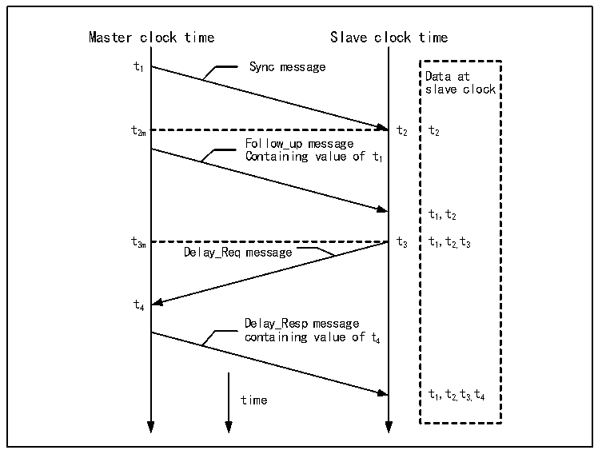

<!-- source-page: 521 -->

[← p.520](0520.md) · [index](../README.md) · [PDF p.521](https://ch32-riscv-ug.github.io/CH32V407/datasheet_en/CH32V407RM.PDF#page=521) · [p.522 →](0522.md)

<!-- header: CH32V407 Reference Manual https://wch-ic.com -->
procedures, and the slave can obtain the time difference between itself and the master and correct it. The following  
figure shows the process of master-slave time synchronization:  

Figure 29-1 IEEE1588 PTP protocol synchronization message timing diagram  
 <!-- rendered from the PDF; verify at https://ch32-riscv-ug.github.io/CH32V407/datasheet_en/CH32V407RM.PDF#page=521 -->

🖼 Text parsed from the figure above

Master clock time Slave clock time  
t Sync message  
1 Data at  
slave clock  
t2m t2 t2  
Follow_up message  
Containing value of t1  
t12,t  
t t t,t t  
3m Delay_Req message 3 1 2, 3  
t4  
Delay_Resp message  
containing value of t4  
t,t t t  
time 1 2, 3, 4  

Step-by-step description:  
● The master sends a syn message to the slave, and the slave receives this message and records the local time t2  
when the syn message is received;  
● The master sends a follow_up message to the slave, including the master time t1 when the master sends the syn  
message;  
● The slave sends a delay_req message to the master, and the slave records the sending time t3;  
● The master sends a delay_resq message to the slave, including the reception time t4 of the delay_req message;  
In actual use, the host sends out a syn message every 2 seconds, and every other syn message can be regarded as  
the follow_up message of the previous syn message, and they will all be accompanied by the sending time of the  
last syn message. Through this process, the slave can know the delay time Tdelay from the master network to the  
slave network, and then calculate the time offset between the master time and the slave time.  
(t21-t ) + (t43-t )  
Tdelay =  
2  
The time sent by either host minus the offset is the host&#x27;s time.  
The synchronization process of PTP is generally implemented through the UDP protocol, of course, the user can  
also implement a custom protocol. PTP is highly dependent on the latency stability of the intranet.  

#### 29.1.9.2 Local Time Update and Correction

In order to implement the PTP host, the device needs to have a high-precision time counter locally, at least to the  
nanosecond level. The PTP module of the microcontroller&#x27;s Gigabit Ethernet counter has a 32-bit counter in seconds,  
and a 31-bit sub-second counter. When the sub-second counter overflows, it will cause the second counter to  
<!-- image: p521-draw-image-00001 bbox=[506.4, 782.88, 526.32, 793.68] -->
<!-- footer: V1.2 519 -->
