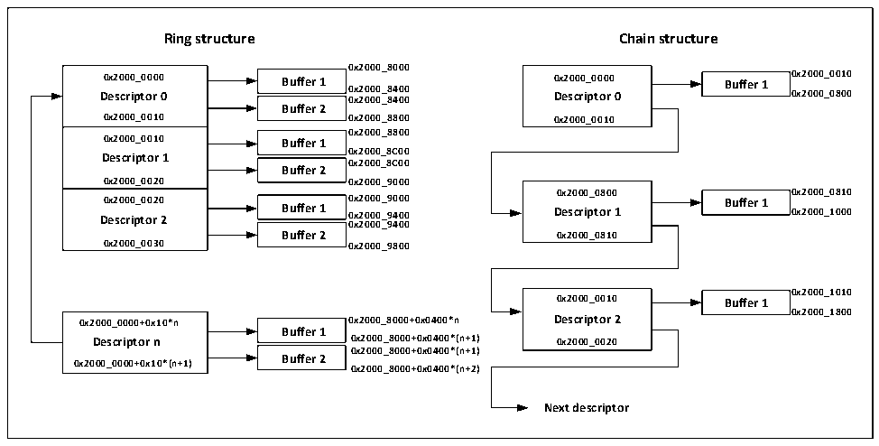

<!-- source-page: 524 -->

[← p.523](0523.md) · [index](../README.md) · [PDF p.524](https://ch32-riscv-ug.github.io/CH32V407/datasheet_en/CH32V407RM.PDF#page=524) · [p.525 →](0525.md)

<!-- header: CH32V407 Reference Manual https://wch-ic.com -->

Figure 29-3 A buffer allocation scheme which describes the ring structure and the chain structure for reference  
 <!-- rendered from the PDF; verify at https://ch32-riscv-ug.github.io/CH32V407/datasheet_en/CH32V407RM.PDF#page=524 -->

when users allocate space.  

🖼 Text parsed from the figure above

<strong>Ring structure Chain structure</strong>  
<strong>0x2000_8000</strong>  
0x2000_0000 Descriptor 00x2000_0010  0x2000_0010 Descriptor 10x2000_0020  0x2000_0020 Descriptor 20x2000_0030  
Buffer 1  Buffer 2  
<strong>D 0 e x2 s 0 c 0 r 0 ip _ t 0 o 0 r 0 0 0 Buffer 1 0 0 x x 2 2 0 0 0 0 0 0 _ _ 8 8 4 4 0 0 0 0 0 D x e 2 s 0 c 0 r 0 i _ p 0 t 0 o 0 r 0 0 Buffer 1 0 0 x x 2 2 0 0 0 0 0 0 _ _ 0 0 0 8 1 0 0 0</strong>  
<strong>0x2000_0010 0x2000_8800 0x2000_0010</strong>  
Buffer 1  Buffer 2  
<strong>0x2000_8800</strong>  
<strong>0x2000_0010 Buffer 1</strong>  
<strong>0x2000_8C00</strong>  
<strong>0x2000_8C00</strong>  
<strong>0x2000_0020 0x2000_9000</strong>  
<strong>0x2000_0800 0x2000_0810</strong>  
Buffer 1  Buffer 2  
<strong>0x2000_0020 0x2000_9000 Buffer 1</strong>  
<strong>Descriptor 2 Buffer 1 0x2000_9400 Descriptor 1 0x2000_1000</strong>  
<strong>0x2000_9400</strong>  
<strong>Buffer 2 0x2000_0810</strong>  
<strong>0x2000_0030 0x2000_9800</strong>  
<strong>0x2000_1010</strong>  
<strong>0x2000_0010 Buffer 1</strong>  
<strong>0x2000_1800</strong>  
Buffer 1  Buffer 2  
<strong>0x2000_0000+0x10*n 0x2000_8000+0x0400*n Descriptor 2</strong>  
<strong>Descriptor n 0x2000_8000+0x0400*(n+1) 0x2000_0020</strong>  
<strong>0x2000_8000+0x0400*(n+1)</strong>  
<strong>0x2000_0000+0x10*(n+1) Buffer 2</strong>  
<strong>0x2000_8000+0x0400*(n+2)</strong>  
<strong>Next descriptor</strong>  

#### 29.1.10.3 Transmit DMA Descriptor

Table 29-4 shows the structure of the transmit descriptor.  
31 0  

<!-- p524-table-006 (table-29-4@1) -->
<table><caption>Table 29-4 Structure of the transmit descriptor</caption><tr><th style="text-align:left">OWM (31)</th><th colspan="2" style="text-align:left">CTRL (30:26)</th><th style="text-align:left">TTSE (25)</th><th>Reserved</th><th colspan="2" style="text-align:left">Control （23:20）</th><th colspan="2" style="text-align:left">Reserved (19:18)</th><th style="text-align:left">TTSS (17)</th><th style="text-align:left">State （16:0）</th></tr><tr><td colspan="2" style="text-align:left">Reserved （31:29）</td><td colspan="4" style="text-align:left">Buffer 2-byte count （28:16）</td><td colspan="2" style="text-align:left">Reserved （15:13）</td><td colspan="3" style="text-align:left">Buffer 1-byte count （12:0）</td></tr><tr><td colspan="11">Buffer 1 address, timestamp low</td></tr><tr><td colspan="11" style="text-align:left">Buffer 2 address, address of next descriptor, timestamp high</td></tr></table>

TDes1  
As can be seen from the above table, the send descriptor consists of four 32-bit words, namely TDes0, TDes1,  
TDes2 and TDes3. TDes0 is used to control and return the sending status, TDes1 is used to indicate the sending  
length, and TDes2 is used to indicate the sending The position of the buffer or the low bit of the sending timestamp  
is returned. TDes3 is used to indicate the address of the second sending buffer (when TCH is not set) or the address  
of the next descriptor (when TCH is set). When the timestamp is enabled, the high bit of the IEEE1588 timestamp  
is returned after sending. Each 32-bit word is described below.  

<!-- p524-table-007 (table-29-5@1) -->
<table><caption>Table 29-5 Definitions of TDes0 bits</caption><tr><th>31</th><th>30</th><th>29</th><th>28</th><th>27</th><th>26</th><th>25</th><th>24</th><th>23:22</th><th>21</th><th>19</th><th>19:18</th><th>17</th><th>16</th></tr><tr><td>OWN</td><td>IC</td><td>LS</td><td>FS</td><td>DC</td><td>DP</td><td>TTE</td><td>Res</td><td>CIC</td><td>TER</td><td>TCH</td><td>Res</td><td>TSS</td><td>IHE</td></tr></table>

<!-- p524-table-008 (table-29-5@1) -->
<table><tr><th>15</th><th>14</th><th>13</th><th>12</th><th>11</th><th>10</th><th>9</th><th>8</th><th>7</th><th>6</th><th>5</th><th>4</th><th>3</th><th>2</th><th>1</th><th>0</th></tr></table>

<!-- image: p524-draw-image-00001 bbox=[506.4, 782.88, 526.32, 793.68] -->
<!-- footer: V1.2 522 -->
