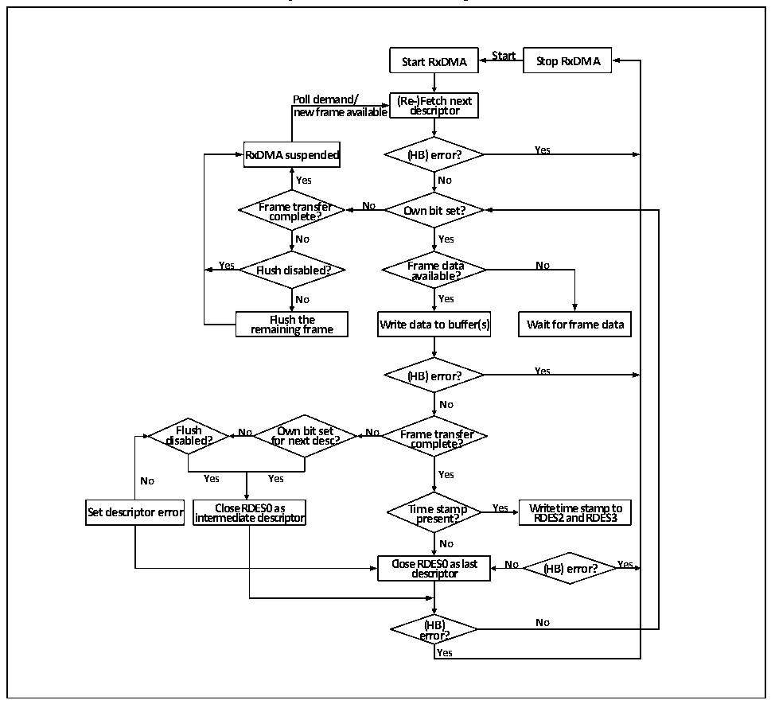

<!-- source-page: 535 -->

[← p.534](0534.md) · [index](../README.md) · [PDF p.535](https://ch32-riscv-ug.github.io/CH32V407/datasheet_en/CH32V407RM.PDF#page=535) · [p.536 →](0536.md)

<!-- header: CH32V407 Reference Manual https://wch-ic.com -->
such as the unavailability of the receive descriptor, and the user needs to pay special attention;  
4) The user needs to enable at least one receive completion interrupt, and restore the used receive descriptor to  
the standby state in the Ethernet interrupt function to ensure that the receive process can run uninterrupted.  
The user can pass the address of the data buffer to be processed in the interrupt function, or handle some  
abnormal events that interrupt the receiving process.  
5) If the MAC opens the IEEE1588PTP mode and enables the enhanced descriptor, when the DMA controller  
dumps data and writes the descriptor status field, the current timestamp will also be written into the last two  
words of the descriptor.  
The following figure shows the default flow mechanism of reception:  

Figure 29-5 Process of reception  
 <!-- rendered from the PDF; verify at https://ch32-riscv-ug.github.io/CH32V407/datasheet_en/CH32V407RM.PDF#page=535 -->

🖼 Text parsed from the figure above

<strong>Start</strong>  
<strong>Start RxDMA Stop RxDMA</strong>  
<strong>Poll demand/ (Re-)Fetch next</strong>  
<strong>new frame available descriptor</strong>  
<strong>RxDMA suspended (HB) error? Yes</strong>  
<strong>Yes No</strong>  
<strong>Frame transfer No Own bit set?</strong>  
<strong>complete?</strong>  
<strong>No Yes</strong>  
<strong>Yes Flush disabled? Frame data No</strong>  
<strong>available?</strong>  
<strong>No Yes</strong>  
<strong>rem F a l i u n s i h ng t h fr e a me Write data to buffer(s) Wait for frame data</strong>  
<strong>(HB) error? Yes</strong>  
<strong>No</strong>  
<strong>Flush No Own bit set No Frame transfer</strong>  
<strong>disabled? for next desc? complete?</strong>  
<strong>No Yes Yes Yes</strong>  
<strong>Set descriptor error inter C m lo e s d e i a R t D e E d S e 0 s c a r s i ptor Ti p m re e s s e t n a t m ? p Yes W R r D it E e S t 2 im an e d s t R a D m E p S 3 to</strong>  
<strong>No</strong>  
<strong>Close d e R s D c E ri S p 0 t o a r s last No (HB) error? Yes</strong>  
<strong>(HB) No</strong>  
<strong>error?</strong>  
<strong>Yes</strong>  

### 29.1.11 Interrupt

The Ethernet transceiver has 2 interrupt vectors, one is the Ethernet wake-up event and the other is the normal  
transceiver event. When a wake-up frame or magic frame is detected, an Ethernet wake-up event is triggered.  
Common Ethernet transceiver interrupt events include DMA interrupt and ETH interrupt.  
<!-- image: p535-draw-image-00001 bbox=[506.4, 782.88, 526.32, 793.68] -->
<!-- footer: V1.2 533 -->
