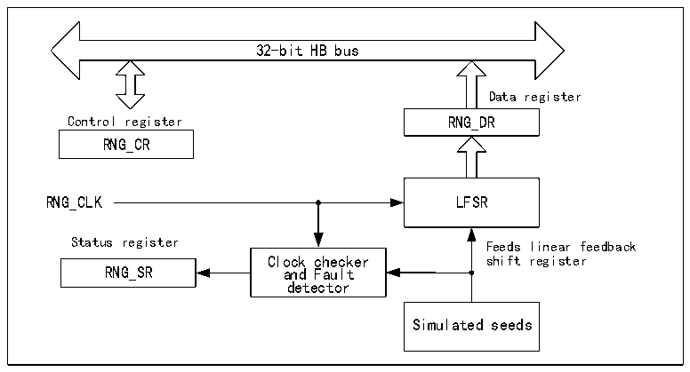

<!-- source-page: 576 -->

[← p.575](0575.md) · [index](../README.md) · [PDF p.576](https://ch32-riscv-ug.github.io/CH32V407/datasheet_en/CH32V407RM.PDF#page=576) · [p.577 →](0577.md)

<!-- header: CH32V407 Reference Manual https://wch-ic.com -->

# Chapter 30 Random Number Generator (RNG)

The chip has a built-in hardware random number generator, which provides a 32-bit random number through an  
internal analog circuit based on continuous analog noise.  

## 30.1 Main Features

● Can generate 32-bit random numbers  
● Error management is possible  
● Can be disabled individually to reduce power consumption  

Figure 30-1 RNG block diagram  
 <!-- rendered from the PDF; verify at https://ch32-riscv-ug.github.io/CH32V407/datasheet_en/CH32V407RM.PDF#page=576 -->

🖼 Text parsed from the figure above

32-bit HB bus  
Data register  
Control register RNG_DR  
RNG_CR  
RNG_CLK LFSR  
Status register Feeds linear feedback  
Clock checker shift register  
RNG_SR and Fault  
detector  
Simulated seeds  

## 30.2 Functional Description

The random transmitter is implemented using an analog circuit that generates a seed for a linear feedback shift  
register (RNG_LFSR) for generating 32-bit random numbers. RNG_LFSR provides clock information at a constant  
frequency by a dedicated clock (PLL48CLK), so the quality of random numbers is related to the HCLK clock. When  
a large number of seeds are introduced into RNG_LFSR, the content of RNG_LFSR will be transferred to the data  
register (RNG_DR).  

### 30.2.1 RNG Operations

RNG operation procedure:  
1） If the interrupt is enabled, by setting the IE bit to 1 in the RNG_CR register (The interrupt is generated when  
a random number is ready or an error occurs).  
2） Random number generation is enabled by configuring the RNGEN bit in the RNG_CR register, while the  
analog section, RNG_LFSR and error detector are activated.  
3） If the interrupt is enabled, every time an interrupt is generated, the SEIS and CEIS bits in the R32_RNG_SR  
register are 0 to confirm that no error occurs and that DRDY is 1 to confirm that the random number is ready.  
The contents of the RNG_DR register can then be read.  
<!-- image: p576-draw-image-00001 bbox=[506.4, 782.88, 526.32, 793.68] -->
<!-- footer: V1.2 574 -->
