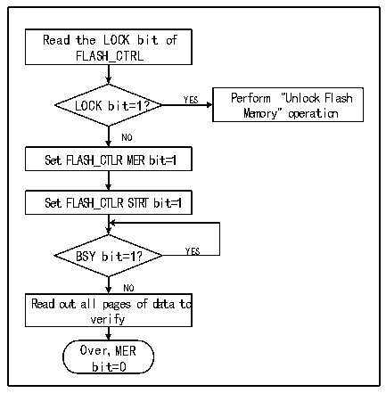

<!-- source-page: 591 -->

[← p.590](0590.md) · [index](../README.md) · [PDF p.591](https://ch32-riscv-ug.github.io/CH32V407/datasheet_en/CH32V407RM.PDF#page=591) · [p.592 →](0592.md)

<!-- header: CH32V407 Reference Manual https://wch-ic.com -->

Figure 32-3 FLASH full chip erasure  
 <!-- rendered from the PDF; verify at https://ch32-riscv-ug.github.io/CH32V407/datasheet_en/CH32V407RM.PDF#page=591 -->

🖼 Text parsed from the figure above

Read the LOCK bit of  
FLASH_CTRL  
LOCK bit=1? YES Perform &quot;Unlock Flash  
Memory&quot; operation  
NO  
Set FLASH_CTLR MER bit=1  
Set FLASH_CTLR STRT bit=1  
BSY bit=1？ YES  
NO  
Read out all pages of data to  
verify  
Over，MER  
bit=0  

1) Check the LOCK bit of the FLASH_CTLR register. If it is 1, you need to perform the &quot;unlock flash lock&quot;  
operation.  
2) Set the MER bit of the FLASH_CTLR register to &#x27;1&#x27; to enable full chip erase mode.  
3) Set the STRT bit of the FLASH_CTLR register to &#x27;1&#x27; to start the erase action.  
4) Wait for the BSY bit to become &#x27;0&#x27; or the EOP bit of the FLASH_STATR register to be &#x27;1&#x27; to indicate the end of  
erasure, and clear the EOP bit to 0.  
5) Read the data of the erased page for verification.  
6) Clear the MER bit to 0.  

### 32.5.5 Fast Programming Mode Unlock

Fast programming mode operation can be unlocked by writing a sequence to the FLASH_MODEKEYR register.  
After unlocking, the block bit of the FLASH_CTLR register will be cleared to 0, indicating that quick erasure and  
programming operations can be performed. Lock again by setting the &quot;FLOCK&quot; bit of the FLASH_CTLR register  
to 1.  
Unlock sequence:  
1) Write KEY1=0x45670123 to the FLASH_MODEKEYR register.  
2) Write KEY2=0xCDEF89AB to the FLASH_MODEKEYR register.  
The above operations must be performed sequentially and continuously, otherwise the error operation will be locked  
and cannot be unlocked until the next system reset.  
<em>Note: Fast programming requires unlocking the &quot;LOCK&quot; and &quot;FLOCK&quot; layers.</em>  

### 32.5.6 Main Memory Fast Programming

The fast programming (256 bytes) is made according to the page.  
1) Check the LOCK bit of the FLASH_CTLR register. If it is &#x27;1&#x27;, you need to perform the &quot;unlock flash&quot; operation.  
2) Check the FLASH_CTLR register FLOCK bit, if it is &#x27;1&#x27;, you need to perform a &quot;quick programming mode  
unlock&quot; operation.  
3) Check the BSY bit of the FLASH_STATR register to confirm that there are no other programming operations in  
progress.  
4) Set the FTPG bit of the FLASH_CTLR register to &#x27;1&#x27; to enable fast page programming mode.  
<!-- image: p591-draw-image-00001 bbox=[506.4, 782.88, 526.32, 793.68] -->
<!-- footer: V1.2 589 -->
