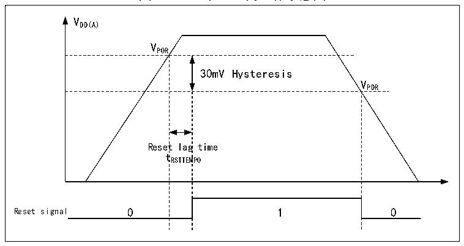

<!-- source-page: 9 -->

[← p.8](0008.md) · [index](../README.md) · [PDF p.9](https://ch32-riscv-ug.github.io/CH32V407/datasheet_zh/CH32V407RM.PDF#page=9) · [p.10 →](0010.md)

<!-- header: CH32V407应用手册 https://wch.cn -->
当主电源VDD 上电稳定后，系统自动切换后备区域由VDD 供电，PC13～PC15可以用作GPIO功能。  
当PC13～PC15引脚作为GPIO输出时，速度必须限制在2MHz以下，最大负载电容为30pF，并  
且禁止用在持续输出和吸入电流的场合，比如LED驱动。  
注：在主电源VDD 恢复供电过程中，内部VBAT 电源仍然通过对应的VBAT 引脚连在外部备用电源上，若  
VDD 在小于复位滞后时间tRSTTEMPO 内就达到稳定，并且高于VBAT 的值0.6V以上，则有可能存在较短瞬间，  
电流通过VDD 与VBAT 之间的二极管灌入VBAT，进而通过VBAT 引脚注入电池等后备电源，如果后备电源无  
法承受这样瞬时注入电流，建议在后备电源和VBAT 引脚之间加一只正向导通低压降二极管。  

## 2.2 电源管理

### 2.2.1 上电复位和掉电复位

系统内部集成了上电复位POR和掉电复位PDR电路，当芯片供电电压VDD 和VDDA 低于对应门限电  
压时，系统被相关电路复位，无需外置额外的复位电路。上电门限电压VPOR 和掉电门限电压VPDR 的参  
数请参考对应的数据手册。  

图2-2 POR和PDR的工作示意图  
 <!-- rendered from the PDF; verify at https://ch32-riscv-ug.github.io/CH32V407/datasheet_zh/CH32V407RM.PDF#page=9 -->

🖼 Text parsed from the figure above

VDD(A)  
VPOR  
30mV Hysteresis  Reset  lag t RSTTEM  g time MPO  
VPDR  

### 2.2.2 可编程电压监测器

可编程电压监测器 PVD，主要被用于监控系统主电源的变化，与电源控制寄存器 PWR_CTLR 的  
PLS[1:0]所设置的门槛电压相比较，配合外部中断寄存器（EXTI）设置，可产生相关中断，以便及  
时通知系统进行数据保存等掉电前操作。  
具体配置如下：  
1） 设置PWR_CTLR寄存器的PLS[1:0]域，选择要监控电压阈值。  
2） 可选的中断处理。PVD功能内部连接EXTI模块的第16线的上升/下降边沿触发设置，开启此中  
断（配置EXTI），当VDD 下降到PVD阈值以下或上升到PVD阈值之上时就会产生PVD中断。  
3） 设置PWR_CTLR寄存器的PVDE位来开启PVD功能。  
4） 读取PWR_CSR状态寄存器的PVD0位可获取当前系统主电源与PLS[1:0]设置阈值关系，执行相应  
软处理。当VDD电压高于PLS[1:0]设置阈值，PVD0位置0；当VDD电压低于PLS[1:0]设置阈值，  
PVD0位置1。  
<!-- image: p9-draw-image-00001 bbox=[507.84, 786.36, 527.28, 796.68] -->
<!-- footer: V1.2 7 -->
