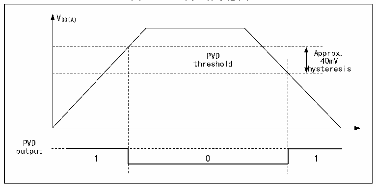

<!-- source-page: 10 -->

[← p.9](0009.md) · [index](../README.md) · [PDF p.10](https://ch32-riscv-ug.github.io/CH32V407/datasheet_zh/CH32V407RM.PDF#page=10) · [p.11 →](0011.md)

<!-- header: CH32V407应用手册 https://wch.cn -->

图2-3 PVD的工作示意图  
 <!-- rendered from the PDF; verify at https://ch32-riscv-ug.github.io/CH32V407/datasheet_zh/CH32V407RM.PDF#page=10 -->

🖼 Text parsed from the figure above

VDD(A)  
PVD threshold  0  
hysteresis  
PVD  
output  

## 2.3 低功耗模式

在系统复位后，微控制器处于正常工作状态（运行模式），此时可以通过降低系统主频或者关  
闭不用外设时钟或者降低工作外设时钟来节省系统功耗。如果系统不需要工作，可设置系统进入低  
功耗模式，并通过特定事件让系统跳出此状态。  
微控制器目前提供了3种低功耗模式，从处理器、外设、电压调节器等的工作差异上分为：  
● 睡眠模式：内核停止运行，所有外设（包含内核私有外设）仍在运行。  
● 停止模式：停止所有时钟，唤醒后系统继续运行。  
● 待机模式：停止所有时钟，唤醒后微控制器复位（电源复位）。  

<!-- p10-table-002 (table-2-1@1) -->
<table><caption>表2-1 低功耗模式一览</caption><tr><th>模式</th><th>进入</th><th>唤醒源</th><th>对时钟的影响</th><th>电压调节器</th></tr><tr><td rowspan="2" style="text-align:left">睡眠 （SLEEP）</td><td>WFI</td><td>任意中断唤醒</td><td rowspan="2" style="text-align:left">内核时钟关闭， 其他时钟无影响</td><td rowspan="2">正常</td></tr><tr><td>WFE</td><td>唤醒事件唤醒</td></tr><tr><td style="text-align:left">停止 (STOP)</td><td style="text-align:left">SLEEPDEEP置1PDDS清0WFI或WFE</td><td style="text-align:left">任意外部中断/事件（EXTI信 号）、NRST 上的外部复位信号、IWDG复位，其中EXTI信号包括77个外部I/O口之一、 PVD 的输出、RTC 闹钟、I3C唤醒信号、USB的唤醒信号。</td><td style="text-align:left">关闭HSE、HSI、 、 PLL和外设时钟</td><td style="text-align:left">正常：LPDS=0或低功耗：LPDS=1</td></tr><tr><td style="text-align:left">待机 (STANDBY)</td><td style="text-align:left">SLEEPDEEP置1PDDS置1WFI或WFE</td><td style="text-align:left">任意外部事件（EXTI信号）、 NRST上的外部复位信号、IWDG 复位、WKUP 引脚上的一个上 升边沿，其中 EXTI 信号包括77个外部I/O口之一、RTC闹钟。</td><td style="text-align:left">关闭HSE、HSI、 PLL和外设时钟</td><td>关闭</td></tr></table>

注：SLEEPDEEP位属于内核私有外设控制位，参考PFIC_SCTLR寄存器。  

### 2.3.1 低功耗配置选项

● WFI和WFE方式  
WFI：微控制器被具有中断控制器响应的中断源唤醒，系统唤醒后，将最先执行中断服务函数（微  
控制器复位除外）。  
WFE：唤醒事件触发微控制器将退出低功耗模式。唤醒事件包括：  
1） 配置一个外部或内部的EXTI线为事件模式，此时无需配置中断控制器；  
2） 或者配置某个中断源，等效为WFI唤醒，系统优先执行中断服务函数；  
<!-- image: p10-draw-image-00001 bbox=[507.84, 786.36, 527.28, 796.68] -->
<!-- footer: V1.2 8 -->
