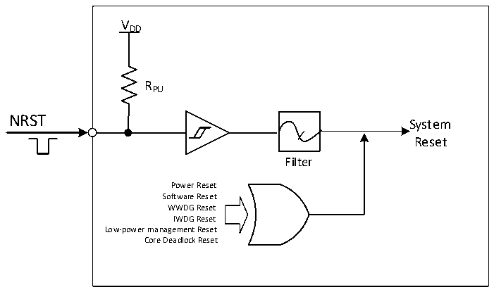

<!-- source-page: 16 -->

[← p.15](0015.md) · [index](../README.md) · [PDF p.16](https://ch32-riscv-ug.github.io/CH32V407/datasheet_zh/CH32V407RM.PDF#page=16) · [p.17 →](0017.md)

<!-- header: CH32V407应用手册 https://wch.cn -->

图3-1系统复位结构  
 <!-- rendered from the PDF; verify at https://ch32-riscv-ug.github.io/CH32V407/datasheet_zh/CH32V407RM.PDF#page=16 -->

🖼 Text parsed from the figure above

VDD  
RPU  
NRST  
System  
Reset  
Filter  
Power Reset  
Software Reset  
WWDG Reset  
IWDG Reset  
Low-power management Reset  
Core Deadlock Reset  

### 3.2.3 后备区域复位

后备区域复位发生时，只会复位后备区域寄存器，包括后备寄存器、RCC_BDCTLR 寄存器（RTC  
使能和LSE振荡器）。其产生条件包括：  
● 在VDD 和VBAT 都掉电的前提下，由VDD 或VBAT 上电引起  
● RCC_BDCTLR寄存器的BDRST位置1  
● RCC_PB1PRSTR寄存器的BKPRST位置1  
<!-- image: p16-draw-image-00001 bbox=[507.84, 786.36, 527.28, 796.68] -->
<!-- footer: V1.2 14 -->
