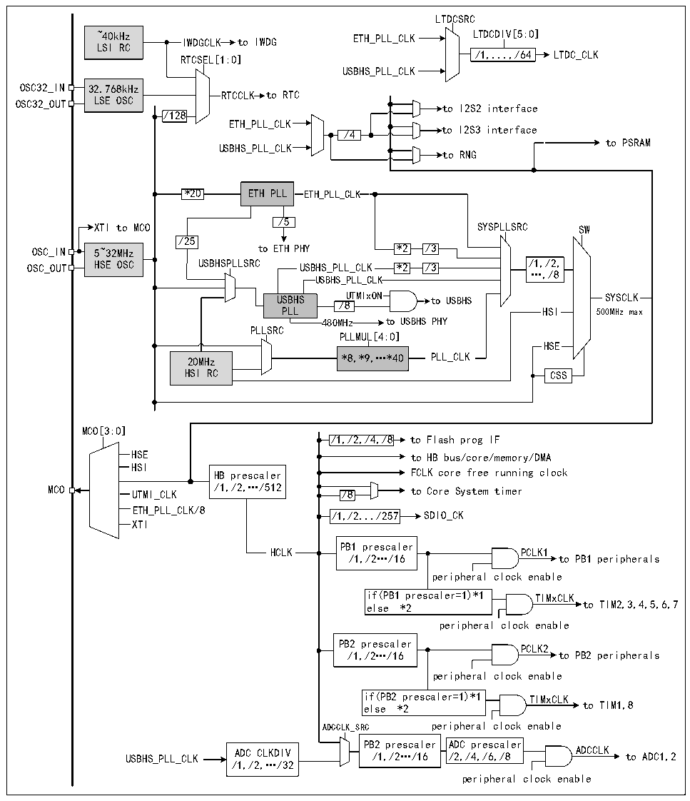

<!-- source-page: 17 -->

[← p.16](0016.md) · [index](../README.md) · [PDF p.17](https://ch32-riscv-ug.github.io/CH32V407/datasheet_zh/CH32V407RM.PDF#page=17) · [p.18 →](0018.md)

<!-- header: CH32V407应用手册 https://wch.cn -->

## 3.3 时钟

### 3.3.1 系统时钟结构

图3-2 时钟树框图  
 <!-- rendered from the PDF; verify at https://ch32-riscv-ug.github.io/CH32V407/datasheet_zh/CH32V407RM.PDF#page=17 -->

🖼 Text parsed from the figure above

LTDCSRC  
~40kHz IWDGCLK to IWDG ETH_PLL_CLK LTDCDIV[5:0]  
LSI RC  
/1,...,/64 LTDC_CLK  
RTCSEL[1:0]  
USBHS_PLL_CLK  
32.768kHz LSE OSC  
RTCCLK to RTC  
OSC32_OUT LSE OSC to I2S2 interface  
/128  
ETH_PLL_CLK  
to I2S3 interface  
/4  
to PSRAM  
USBHS_PLL_CLK  
to RNG  
*20 ETH PLL ETH_PLL_CLK  
/5  
XTI to MCO SYSPLLSRC SW  
/25  
OSC_IN 5~32MHz to ETH PHY *2 /3  
OSC_OUT HSE OSC USBHSPLLSRC USBHS_PLL_CLK *2 /3 /1,/2,  
…,/8  
USBHS_PLL_CLK  
USBHS UTMIxON to USBHS SYSCLK  
/8  
PLL HSI 500MHz max  
480MHz to USBHS PHY  
PLLSRC  
PLLMUL[4:0]  
HSE  
20MHz *8,*9,…*40 PLL_CLK  
HSI RC CSS  
MCO[3:0]  
/1,/2,/4,/8 to Flash prog IF  
/1,/2,/4,/8  /1,/2,/4,/8  
HSE to HB bus/core/memory/DMA  
HSI  
HB prescaler FCLK core free running clock  
UTMI_CLK  
MCO UTMI_CLK /1,/2,…/512 /8 to Core System timer  
ETH_PLL_CLK/8  
/1,/2.../257  /1,/2.../257  
XTI  
PB1 prescaler  
HCLK PCLK1  
/1,/2…/16 to PB1 peripherals  
peripheral clock enable  
if(PB1 prescaler=1)*1 TIMxCLK  
else *2 to TIM2,3,4,5,6,7  
peripheral clock enable  
PB2 prescaler  
PCLK2  
/1,/2…/16 to PB2 peripherals  
peripheral clock enable  
if(PB2 prescaler=1)*1 TIMxCLK  
else *2 to TIM1,8  
ADCCLK_SRC peripheral clock enable  
PB2 prescaler ADC prescaler  
USBHS_PLL_CLK ADC CLKDIV /1,/2…/16 /2,/4,/6,/8 ADCCLK to ADC1,2  
/1,/2,…/32  
peripheral clock enable  

### 3.3.2 高速时钟（HSI/HSE）

HSI是系统内部20MHz的RC振荡器产生的高速时钟信号。HSI RC振荡器能够在不需要任何外部  
器件的条件下提供系统时钟。它的启动时间很短但时钟频率精度较差。HSI通过设置RCC_CTLR寄存  
器中的HSION位被启动和关闭，HSIRDY位指示HSI RC振荡器是否稳定。系统默认HSION和HSIRDY  
置1（建议不要关闭）。如果设置了RCC_INTR寄存器的HSIRDYIE位，将产生相应中断。  
● 出厂校准：制造工艺的差异会导致每个芯片的RC振荡频率不同，所以在芯片出厂前，会为每颗  
芯片进行HSI校准。系统复位后，工厂校准值被装载到RCC_CTLR寄存器的HSICAL[7:0]中。  
<!-- image: p17-draw-image-00001 bbox=[507.84, 786.36, 527.28, 796.68] -->
<!-- footer: V1.2 15 -->
