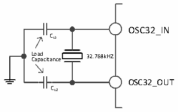
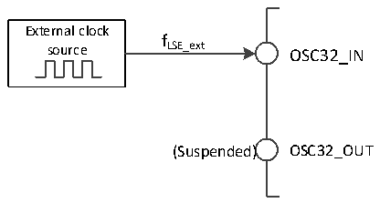

<!-- source-page: 19 -->

[← p.18](0018.md) · [index](../README.md) · [PDF p.19](https://ch32-riscv-ug.github.io/CH32V407/datasheet_zh/CH32V407RM.PDF#page=19) · [p.20 →](0020.md)

<!-- header: CH32V407应用手册 https://wch.cn -->

图3-5 低速外部晶体电路  
 <!-- rendered from the PDF; verify at https://ch32-riscv-ug.github.io/CH32V407/datasheet_zh/CH32V407RM.PDF#page=19 -->

🖼 Text parsed from the figure above

OSC32_IN  
CL1  
L C o ap ad a citance 32.768kHZ  
OSC32_OUT  
CL2  

● 外部低速时钟源（LSE旁路）：此模式从外部直接送入时钟源到OSC32_IN引脚，OSC32_OUT引  
脚悬空。应用程序需在LSEON位为0情况下，置位LSEBYP位，打开LSE旁路功能，然后再置位LSEON  
位。  

图3-6 低速时钟源电路  
 <!-- rendered from the PDF; verify at https://ch32-riscv-ug.github.io/CH32V407/datasheet_zh/CH32V407RM.PDF#page=19 -->

🖼 Text parsed from the figure above

External clock  
f  
source LSE_ext OSC32_IN  
(Suspended) OSC32_OUT  

### 3.3.4 系统PLL 时钟（SYSPLL）

通过配置RCC_CFGR0寄存器和RCC_CFGR2寄存器，系统PLL时钟可以选择5种时钟来源和分频  
系数，这些设置必须在每个PLL被开启前完成，一旦PLL被启动，这些参数就不能被改动。  
设置RCC_CTLR寄存器中的PLLON位被启动和关闭，PLLRDY位指示PLL时钟是否稳定，硬件在  
PLLRDY位置1后才将时钟送入系统。  
通过配置RCC_CTLR寄存器中的ETH_PLLON位被启动和关闭，ETH_PLLRDY位指示ETH_PLL时钟  
是否稳定，硬件在ETH_PLLRDY位置1后才将时钟送入系统。  
设置RCC_CTLR寄存器中的USBHS_PLLON位被启动和关闭，USBHS_PLLRDY位指示USBHS_PLL时  
钟是否稳定，硬件在USBHS_PLLRDY位置1后才将时钟送入系统。  
SYSPLL时钟来源：  
● PLL_CLK时钟送入  
● USBHS_PLL(480MHz)时钟送入  
● ETH_PLL(500MHz)时钟送入  
● USBHS_PLL(320MHz)分频时钟送入  
● ETH_PLL(333MHz)分频时钟送入  

### 3.3.5 总线/外设时钟

#### 3.3.5.1 系统时钟（SYSCLK）

通过配置RCC_CFGR0寄存器SW[1:0]位配置系统时钟来源，SWS[1:0]指示当前的系统时钟源。  
● HSI作为系统时钟  
● HSE作为系统时钟  
● SYSPLL时钟作为系统时钟  
控制器复位后，默认HSI时钟被选为系统时钟源。时钟源之间的切换必须在目标时钟源准备就  
绪后才会发生。  

#### 3.3.5.2 HB/PB1/PB2总线外设时钟（HCLK/PCLK1/PCLK2）

<!-- image: p19-draw-image-00001 bbox=[507.84, 786.36, 527.28, 796.68] -->
<!-- footer: V1.2 17 -->
