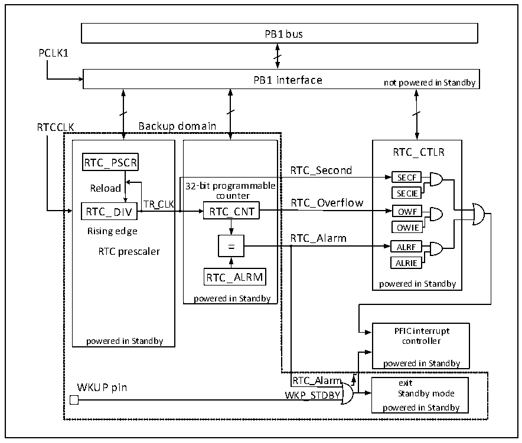

<!-- source-page: 44 -->

[← p.43](0043.md) · [index](../README.md) · [PDF p.44](https://ch32-riscv-ug.github.io/CH32V407/datasheet_zh/CH32V407RM.PDF#page=44) · [p.45 →](0045.md)

<!-- header: CH32V407应用手册 https://wch.cn -->

# 第 6 章 实时时钟（RTC）

实时时钟（RTC）是一个独立的定时器模块，其可编程计数器最大可达到32位，配合软件即可  
以实现实时时钟功能，并且可以修改计数器的值来重新配置系统的当前时间和日期。RTC 模块在后  
备供电区域，系统复位和待机模式唤醒对其不造成影响。  

## 6.1 主要特征

● 最高为220的预分频系数  
● 32位可编程计数器  
● 多种时钟源，中断  
● 独立复位  

## 6.2 功能描述

### 6.2.1 概述

图6-1 RTC结构框图  
 <!-- rendered from the PDF; verify at https://ch32-riscv-ug.github.io/CH32V407/datasheet_zh/CH32V407RM.PDF#page=44 -->

🖼 Text parsed from the figure above

PB1 bus  
PCLK1  
PB1 interface  
not powered in Standby  
RTCCLK Backup domain  
32-bit programmable counter RTC_CNTRTC_ALRM powered in Standby  
RTC_CTLR  
RTC_PSCR  
RTC_Second  
SECF  
counter SECIE  
Rising edge OWIE  
RTC_Alarm  
ALRIE  
powered in Standby  
PFIC interrupt  
powered in Standby controller  
powered in Standby  
RTC_Alarm  
exit  
WKUP pin  
WKP_STDBY Standby mode  
powered in Standby  

由图 6-1所示，RTC 模块主要是 PB1 总线接口、分频器和计数器、控制和状态寄存器三部分组  
成，其中分频器和计数器部分在后备区域，可由 VBAT 供电。RTCCK 输入分频器（RTC_DIV）之后，被  
分频成 TR_CLK。值得注意的是，分频器（RTC_DIV）的内部是一个自减计数器，自减到溢出就会输  
出一个TR_CLK，然后从重装值寄存器（RTC_PSCR）里取出预设值重装到分频器里，读分频器实际上  
是读取它的实时值（read only），写分频系数应该写到重装值寄存器（RTC_PSCR）里。一般TR_CLK  
<!-- image: p44-draw-image-00001 bbox=[507.84, 786.36, 527.28, 796.68] -->
<!-- footer: V1.2 42 -->
