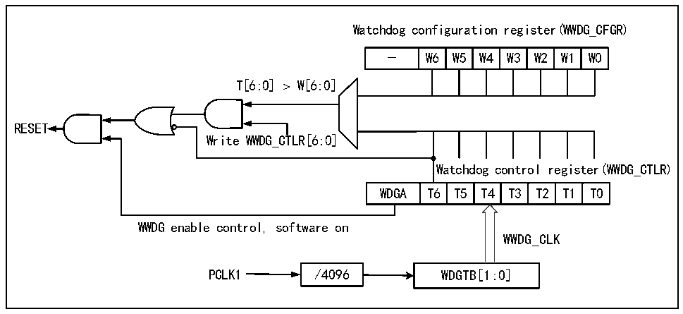

<!-- source-page: 53 -->

[← p.52](0052.md) · [index](../README.md) · [PDF p.53](https://ch32-riscv-ug.github.io/CH32V407/datasheet_zh/CH32V407RM.PDF#page=53) · [p.54 →](0054.md)

<!-- header: CH32V407应用手册 https://wch.cn -->

# 第 8 章 窗口看门狗（WWDG）

窗口看门狗一般用来监测系统运行的软件故障，例如外部干扰、不可预见的逻辑错误等情况。  
它需要在一个特定的窗口时间（有上下限）内进行计数器刷新（喂狗），否则早于或者晚于这个窗  
口时间看门狗电路都会产生系统复位。  

## 8.1 主要特征

● 可编程的7位自减型计数器  
● 双条件复位：当前计数器值小于0x40，或者计数器值在窗口时间外被重装载  
● 唤醒提前通知功能（EWI），用于及时喂狗动作防止系统复位  

## 8.2 功能说明

### 8.2.1 原理和用法

窗口看门狗运行基于一个 7 位的递减计数器，其挂载在 PB1 总线下，计数时基 WWDG_CLK 来源  
（PCLK1/4096）时钟的分频，分频系数在配置寄存器WWDG_CFGR中的WDGTB[1:0]域设置。递减计数  
器处于自由运行状态，无论看门狗功能是否开启，计数器一直循环递减计数。如图8-1所示，窗口  
看门狗内部结构框图。  

图8-1 窗口看门狗结构框图  
 <!-- rendered from the PDF; verify at https://ch32-riscv-ug.github.io/CH32V407/datasheet_zh/CH32V407RM.PDF#page=53 -->

🖼 Text parsed from the figure above

Watchdog configuration register(WWDG_CFGR)  
-  W6  W5  W4  W3  W2  W1  W0  
T[6:0] ＞ W[6:0]  
RESET  
Write WWDG_CTLR[6:0]  
Watchdog control register(WWDG_CTLR)  
WDGA  T6  T5  T4  T3  T2  T1  T0  
WWDG enable control, software on  
WWDG_CLK  
PCLK1 / 4 0 9 6 W D G T B[1:0]  

● 启动窗口看门狗  
系统复位后，看门狗处于关闭状态，设置WWDG_CTLR寄存器的WDGA位能够开启看门狗，随后它  
不能再被关闭，除非发生复位。  
注：可以通过设置RCC_PB1PCENR寄存器关闭WWDG的时钟来源，暂停WWDG_CLK计数，间接停止看门  
狗功能，或者通过设置RCC_PB1PRSTR寄存器复位WWDG模块，等效为复位的作用。  
● 看门狗配置  
看门狗内部是一个不断循环递减运行的7位计数器，支持读写访问。使用看门狗复位功能，需  
要执行下面几点操作：  
1） 计数时基：通过WWDG_CFGR寄存器的WDGTB[1:0]位域，注意要开启RCC单元的WWDG模块时钟。  
2） 窗口计数器：设置WWDG_CFGR寄存器的W[6:0]位域，此计数器由硬件用作和当前计数器比较使  
用，数值由用户软件配置，不会改变。作为窗口时间的上限值。  
<!-- image: p53-draw-image-00001 bbox=[507.84, 786.36, 527.28, 796.68] -->
<!-- footer: V1.2 51 -->
