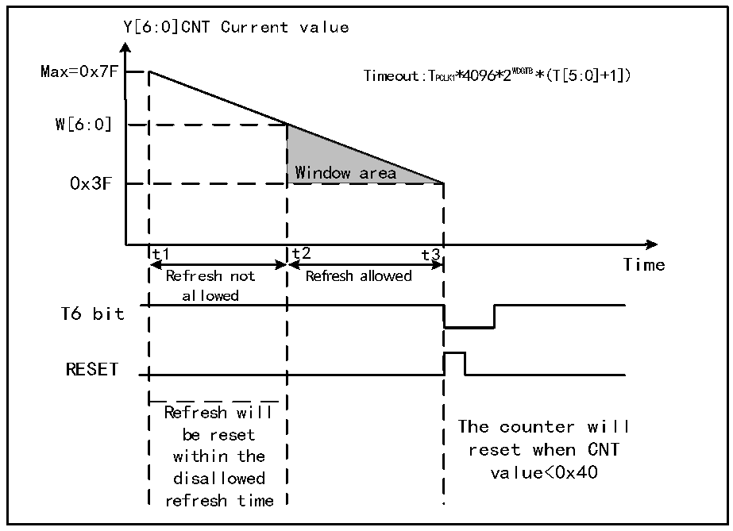

<!-- source-page: 54 -->

[← p.53](0053.md) · [index](../README.md) · [PDF p.54](https://ch32-riscv-ug.github.io/CH32V407/datasheet_zh/CH32V407RM.PDF#page=54) · [p.55 →](0055.md)

<!-- header: CH32V407应用手册 https://wch.cn -->
3） 看门狗使能：WWDG_CTLR寄存器WDGA位软件置1，开启看门狗功能，可以系统复位。  
4） 喂狗：即刷新当前计数器值，配置WWDG_CTLR寄存器的T[6:0]位域。此动作需要在看门狗功能  
开启后，在周期性的窗口时间内执行，否则会出现看门狗复位动作。  
● 喂狗窗口时间  
如图8-2所示，灰色区域为窗口看门狗的监测窗口区域，其上限时间t2对应当前计数器值达到  
窗口值 W[6:0]的时间点；其下限时间 t3 对应当前计数器值达到 0x3F 的时间点。此区域时间内  
t2&lt;t&lt;t3可以进行喂狗操作（写T[6:0]），刷新当前计数器的数值。  

图8-2 窗口看门狗的计数模式  
 <!-- rendered from the PDF; verify at https://ch32-riscv-ug.github.io/CH32V407/datasheet_zh/CH32V407RM.PDF#page=54 -->

🖼 Text parsed from the figure above

Y[6:0]CNT Current value  
Max=0x7F Timeout:TPCLK1*4096*2 WD GT B*(T[5:0]+1])  
W[6:0]  
Window area  
0x3F  
t1 t2 t3  
Time  
Refresh not Refresh allowed  
allowed  
T6 bit  
RESET  
Refresh will  
The counter will  
be reset  
reset when CNT  
within the  
value&lt;0x40  
disallowed  
refresh time  

● 看门狗复位：  
1） 当没有及时喂狗操作，导致T[6:0]计数器的值由0x40变成0x3F，将出现“窗口看门狗复位”，  
产生系统复位。即T6-bit被硬件检测为0，将出现系统复位。  
注：应用程序可以通过软件写T6-bit为0，实现系统复位，等效软件复位功能。  
2） 当在不允许喂狗时间内执行计数器刷新动作，即在t1≤t≤t2时间内操作写T[6:0]位域，将出  
现“窗口看门狗复位”，产生系统复位。  
● 提前唤醒  
为了防止没有及时刷新计数器导致系统复位，看门狗模块提供了早期唤醒中断（EWI）通知。当  
计数器自减到0x40时，产生提前唤醒信号，WEIF标志置1，如果置位了EWI位，会同时触发窗口看  
门狗中断。此时距离硬件复位有1个计数器时钟周期（自减为0x3F），应用程序可在此时间内即时  
进行喂狗操作。  

### 8.2.2 调试模式

系统进入调试模式时，可以由调试模块寄存器配置WWDG的计数器继续工作或停止。  
<!-- image: p54-draw-image-00001 bbox=[507.84, 786.36, 527.28, 796.68] -->
<!-- footer: V1.2 52 -->
