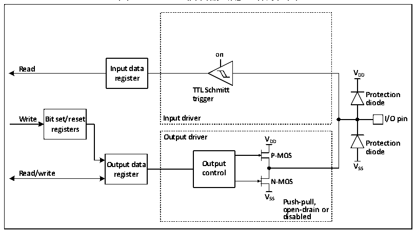
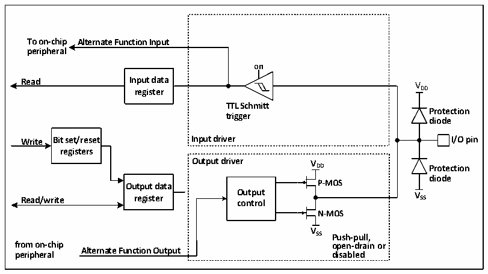

<!-- source-page: 104 -->

[← p.103](0103.md) · [index](../README.md) · [PDF p.104](https://ch32-riscv-ug.github.io/CH32V407/datasheet_zh/CH32V407RM.PDF#page=104) · [p.105 →](0105.md)

<!-- header: CH32V407应用手册 https://wch.cn -->

### 10.2.7 输出配置

图10-3 GPIO模块输出配置结构框图  
 <!-- rendered from the PDF; verify at https://ch32-riscv-ug.github.io/CH32V407/datasheet_zh/CH32V407RM.PDF#page=104 -->

🖼 Text parsed from the figure above

<strong>on</strong>  
<strong>Read Input data</strong>  
<strong>V</strong>  
<strong>register DD</strong>  
<strong>TTL Schmitt</strong>  
<strong>Protection</strong>  
<strong>trigger</strong>  
<strong>diode</strong>  
<strong>Write Bit set/reset Input driver I/O pin</strong>  
<strong>registers</strong>  
<strong>Output driver V</strong>  
<strong>DD Protection</strong>  
<strong>diode</strong>  
<strong>P-MOS</strong>  
<strong>Output data Output VSS</strong>  
<strong>Read/write register control</strong>  
<strong>N-MOS</strong>  
<strong>V</strong>  
<strong>SS Push-pull,</strong>  
<strong>open-drain or</strong>  
<strong>disabled</strong>  

当IO口配置成输出模式时，输出驱动器中的一对MOS可根据需要被配置成推挽或开漏模式，不  
使用复用功能。输入驱动的上下拉电阻被禁用，TTL施密特触发器被激活，出现在IO引脚上的电平  
将会在每个PB2时钟被采样到输入数据寄存器，所以读取输入数据寄存器将会得到IO状态，在推挽  
输出模式时，对输出数据寄存器的访问就会得到最后一次写入的值。  

### 10.2.8 复用功能配置

图10-4 GPIO模块被其他外设复用时的结构框图  
 <!-- rendered from the PDF; verify at https://ch32-riscv-ug.github.io/CH32V407/datasheet_zh/CH32V407RM.PDF#page=104 -->

🖼 Text parsed from the figure above

<strong>To on-chip Alternate Function Input</strong>  
<strong>peripheral</strong>  
<strong>on</strong>  
<strong>Read Input data V</strong>  
<strong>register DD</strong>  
<strong>TTL Schmitt</strong>  
<strong>Protection</strong>  
<strong>trigger</strong>  
<strong>diode</strong>  
<strong>Write Bit set/reset Input driver I/O pin</strong>  
<strong>registers</strong>  
<strong>Output driver V</strong>  
<strong>DD Protection</strong>  
<strong>diode</strong>  
<strong>Output data P-MOS</strong>  
<strong>Read/write register O co u n t t p r u o t l V SS</strong>  
<strong>N-MOS</strong>  
<strong>V</strong>  
<strong>SS Push-pull,</strong>  
<strong>from on-chip open-drain or</strong>  
<strong>Alternate Function Output</strong>  
<strong>peripheral disabled</strong>  

在启用复用功能时，输出驱动器被使能，可以按需要被配置成开漏或推挽模式，施密特触发器  
也被打开，复用功能的输入和输出线都被连接，但是输出数据寄存器被断开，出现在IO引脚上的电  
平将会在每个PB2时钟被采样到输入数据寄存器，在开漏模式下，读取输入数据寄存器将会得到IO  
口当前状态；在推挽模式下，读取输出数据寄存器将会得到最后一次写入的值。  
<!-- image: p104-draw-image-00001 bbox=[507.84, 786.36, 527.28, 796.68] -->
<!-- footer: V1.2 102 -->
