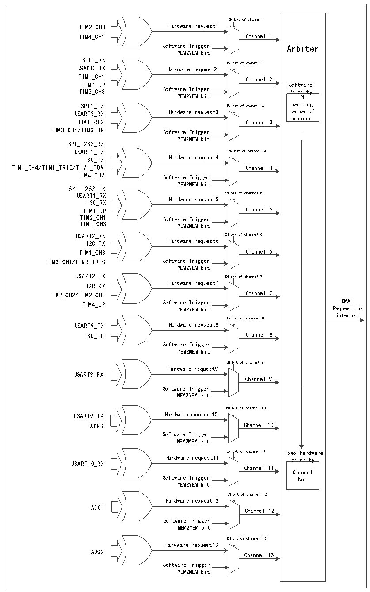

<!-- source-page: 134 -->

[← p.133](0133.md) · [index](../README.md) · [PDF p.134](https://ch32-riscv-ug.github.io/CH32V407/datasheet_zh/CH32V407RM.PDF#page=134) · [p.135 →](0135.md)

<!-- header: CH32V407应用手册 https://wch.cn -->

图11-1 DMA1请求映像  
 <!-- rendered from the PDF; verify at https://ch32-riscv-ug.github.io/CH32V407/datasheet_zh/CH32V407RM.PDF#page=134 -->

🖼 Text parsed from the figure above

EN bit of channel 1  
TIM2_CH3 Hardware request1  
TIM4_CH1 Channel 1  
Software Trigger Arbiter  
MEM2MEM bit  
SPI1_RX  
EN bit of channel 2  
USART3_TX Hardware request2  
TIM1_CH1  
Channel 2  
TIM2_UP Software  
TIM3_CH3 Software Trigger Priority  
MEM2MEM bit PL  
SPI1_TX EN bit of channel 3 setting  
USART3_RX Hardware request3 value of  
channel  
TIM1_CH2 Channel 3  
TIM3_CH4/TIM3_UP Software Trigger  
MEM2MEM bit  
SPI_I2S2_RX  
USART1_TX EN bit of channel 4  
I3C_TX Hardware request4  
TIM1_CH4/TIM1_TRIG/TIM1_COM Channel 4  
TIM4_CH2 Software Trigger  
MEM2MEM bit  
SPI_I2S2_TX  
USART1_RX EN bit of channel 5  
Hardware request5  
I3C_RX  
TIM1_UP Channel 5  
TIM2_CH1 Software Trigger  
TIM4_CH3 MEM2MEM bit  
USART2_RX EN bit of channel 6  
I2C_TX Hardware request6  
TIM1_CH3 Channel 6  
TIM3_CH1/TIM3_TRIG Software Trigger  
MEM2MEM bit  
USART2_TX EN bit of channel 7  
Hardware request7  
I2C_RX  
TIM2_CH2/TIM2_CH4 Channel 7  
TIM4_UP Software Trigger DMA1  
MEM2MEM bit Request to  
internal  
EN bit of channel 8  
USART9_TX Hardware request8  
I3C_TC Channel 8  
Software Trigger  
MEM2MEM bit  
EN bit of channel 9  
Hardware request9  
USART9_RX  
Channel 9  
Software Trigger  
MEM2MEM bit  
EN bit of channel 10  
USART9_TX Hardware request10  
ARGB Channel 10  
Software Trigger  
MEM2MEM bit  
EN bit of channel 11 Fixed hardware  
Hardware request11 priority  
USART10_RX  
Channel 11  
Channel  
Software Trigger No.  
MEM2MEM bit  
EN bit of channel 12  
Hardware request12  
ADC1  
Channel 12  
Software Trigger  
MEM2MEM bit  
EN bit of channel 13  
Hardware request13  
ADC2  
Channel 13  
Software Trigger  
MEM2MEM bit  

<!-- image: p134-draw-image-00001 bbox=[507.84, 786.36, 527.28, 796.68] -->
<!-- footer: V1.2 132 -->
