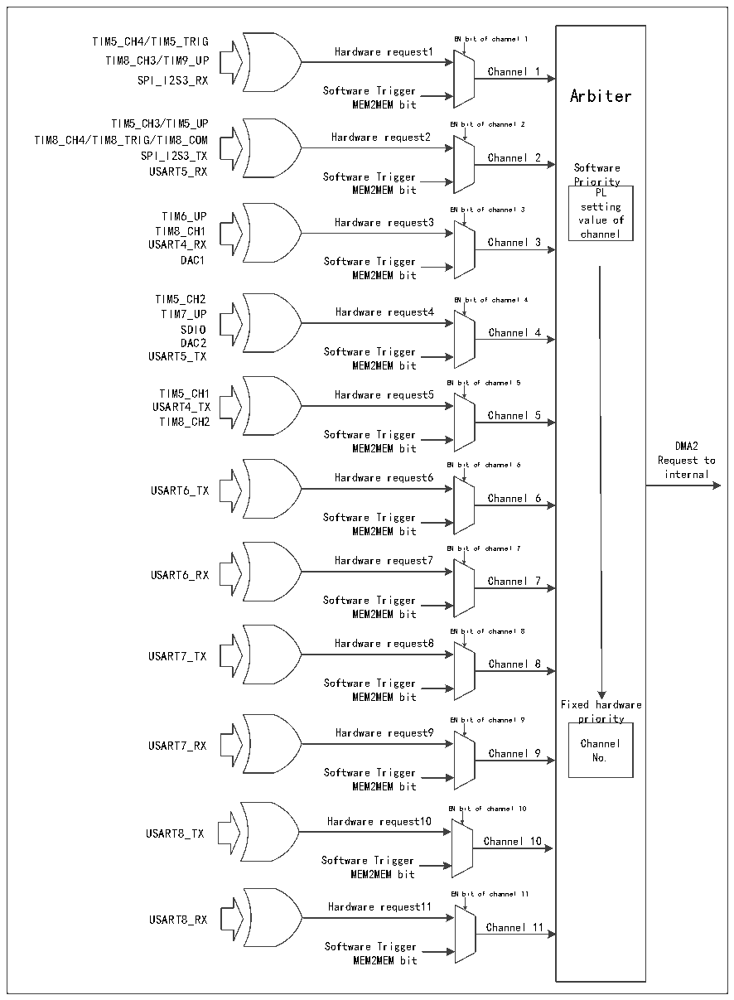

<!-- source-page: 135 -->

[← p.134](0134.md) · [index](../README.md) · [PDF p.135](https://ch32-riscv-ug.github.io/CH32V407/datasheet_zh/CH32V407RM.PDF#page=135) · [p.136 →](0136.md)

<!-- header: CH32V407应用手册 https://wch.cn -->

图11-2 DMA2请求映像  
 <!-- rendered from the PDF; verify at https://ch32-riscv-ug.github.io/CH32V407/datasheet_zh/CH32V407RM.PDF#page=135 -->

🖼 Text parsed from the figure above

TIM5_CH4/TIM5_TRIG EN bit of channel 1  
Hardware request1  
TIM8_CH3/TIM9_UP  
Channel 1  
SPI_I2S3_RX  
Software Trigger Arbiter  
MEM2MEM bit  
TIM5_CH3/TIM5_UP EN bit of channel 2  
TIM8_CH4/TIM8_TRIG/TIM8_COM Hardware request2  
SPI_I2S3_TX Channel 2  
USART5_RX Software Trigger S P o r f i t o w r a i r t e y  
MEM2MEM bit PL  
setting  
TIM6_UP Hardware request3 EN bit of channel 3 value of  
TIM8_CH1 channel  
USART4_RX Channel 3  
DAC1 Software Trigger  
MEM2MEM bit  
TIM5_CH2 EN bit of channel 4  
TIM7_UP Hardware request4  
SDIO Channel 4  
DAC2  
USART5_TX Software Trigger  
MEM2MEM bit  
EN bit of channel 5  
TIM5_CH1 Hardware request5  
USART4_TX  
Channel 5  
TIM8_CH2  
Software Trigger  
MEM2MEM bit DMA2  
Request to  
EN bit of channel 6  
Hardware request6 internal  
USART6_TX  
Channel 6  
Software Trigger  
MEM2MEM bit  
EN bit of channel 7  
Hardware request7  
USART6_RX  
Channel 7  
Software Trigger  
MEM2MEM bit  
EN bit of channel 8  
Hardware request8  
USART7_TX  
Channel 8  
Software Trigger  
MEM2MEM bit  
Fixed hardware  
EN bit of channel 9 priority  
Hardware request9  
USART7_RX Channel  
Channel 9 No.  
Software Trigger  
MEM2MEM bit  
EN bit of channel 10  
Hardware request10  
USART8_TX  
Channel 10  
Software Trigger  
MEM2MEM bit  
EN bit of channel 11  
Hardware request11  
USART8_RX  
Channel 11  
Software Trigger  
MEM2MEM bit  

<!-- p135-table-001 (table-11-2@1) pages 135-136 -->
<table><caption>表11-2 DMA1各通道外设映射表</caption><tr><th>外设</th><th>通道1</th><th>通道2</th><th>通道3</th><th>通道4</th><th>通道5</th><th>通道6</th><th>通道7</th></tr><tr><td>SPI1</td><td></td><td>SPI1_RX</td><td>SPI1_TX</td><td></td><td></td><td></td><td></td></tr><tr><td>SPI/I2S2</td><td></td><td></td><td></td><td style="text-align:left">SPI_I2S2_ RX</td><td style="text-align:left">SPI_I2S2_ TX</td><td></td><td></td></tr><tr><td>USART1</td><td></td><td></td><td></td><td>USART1_TX</td><td>USART1_RX</td><td></td><td></td></tr><tr><td>USART2</td><td></td><td></td><td></td><td></td><td></td><td>USART2_RX</td><td>USART2_TX</td></tr><tr><td>USART3</td><td></td><td>USART3_TX</td><td>USART3_RX</td><td></td><td></td><td></td><td></td></tr><tr><td>I2C</td><td></td><td></td><td></td><td></td><td></td><td>I2C_TX</td><td>I2C_RX</td></tr><tr><td>I3C</td><td></td><td></td><td></td><td>I3C_TX</td><td>I3C_RX</td><td></td><td></td></tr><tr><td>TIM1</td><td></td><td>TIM1_CH1</td><td>TIM1_CH2</td><td style="text-align:left">TIM1_CH4TIM1_TRIGTIM1_COM</td><td>TIM1_UP</td><td>TIM1_CH3</td><td></td></tr><tr><td>TIM2</td><td>TIM2_CH3</td><td>TIM2_UP</td><td></td><td></td><td>TIM2_CH1</td><td></td><td style="text-align:left">TIM2_CH2TIM2_CH4</td></tr><tr><td>TIM3</td><td></td><td>TIM3_CH3</td><td style="text-align:left">TIM3_UPTIM3_CH4</td><td></td><td></td><td style="text-align:left">TIM3_CH1TIM3_TRIG</td><td></td></tr><tr><td>TIM4</td><td>TIM4_CH1</td><td></td><td></td><td>TIM4_CH2</td><td>TIM4_CH3</td><td></td><td>TIM4_UP</td></tr></table>

<!-- image: p135-draw-image-00001 bbox=[507.84, 786.36, 527.28, 796.68] -->
<!-- footer: V1.2 133 -->
