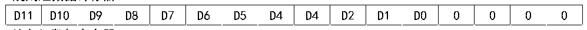

<!-- source-page: 146 -->

[← p.145](0145.md) · [index](../README.md) · [PDF p.146](https://ch32-riscv-ug.github.io/CH32V407/datasheet_zh/CH32V407RM.PDF#page=146) · [p.147 →](0147.md)

<!-- header: CH32V407应用手册 https://wch.cn -->
3）通道配置  
ADC模块提供了18个通道采样源，包括16个外部通道和2个内部通道。它们可以配置到两种  
转换组中：规则组和注入组。以实现任意多个通道上以任意顺序进行一系列转换构成的组转换。  
转换组：  
● 规则组：由多达16个转换组成。规则通道和它们的转换顺序在ADCx_RSQRx寄存器中设置。  
规则组中转换的总数量应写入ADCx_RSQR1寄存器的L[3:0]中。  
● 注入组：由多达4个转换组成。注入通道和它们的转换顺序在ADCx_ISQR寄存器中设置。  
注入组里的转换总数量应写入ADCx_ISQR寄存器的JL[1:0]中。  
注：如果ADCx_RSQRx或ADCx_ISQR寄存器在转换期间被更改，当前的转换被终止，一个新的启动信  
号将发送到ADC以转换新选择的组。  
2个内部通道：  
● 温度传感器：连接ADC_IN16通道，用来测量芯片内部温度。  
● VREFINT 内部参考电压：连接ADC_IN17通道。  
4）校准  
通过写ADCx_CTLR2寄存器的RSTCAL位置1初始化校准寄存器，等待RSTCAL硬件清0表示初始  
化完成。置位CAL位，启动校准功能，一旦校准结束，硬件会自动清除CAL位。进行偏移校准。之  
后可以开始正常的转换功能，每次ADC转后加上偏移值。建议在ADC模块上电时执行一次ADC校准。  
注：启动校准前，必须保证ADC模块处于上电状态(ADON=1)超过至少两个ADC时钟周期。  
5）可编程采样时间  
ADC 使用若干个 ADCCLK 周期对输入电压采样，通道的采样周期数目可以通过ADCx_SAMPTR1 和  
ADCx_SAMPTR2寄存器中的SMPx[2:0]位更改。每个通道可以分别使用不同的时间采样。  
总转换时间如下计算：  
TCONV= 采样时间 + 12.5TADCCLK  
采样时间可以根据SMPx[2:0]决定。  
ADC 的规则通道转换支持 DMA 功能。规则通道转换的值储存在一个仅有的数据寄存器  
ADCx_RDATAR 中，为防止连续转换多个规则通道时，没有及时取走 ADCx_RDATAR 寄存器中的数据，  
可以开启ADC的DMA功能。硬件会在规则通道的转换结束时（EOC置位）产生DMA请求，并将转换  
的数据从ADCx_RDATAR寄存器传输到用户指定的目的地址。  
对DMA控制器模块的通道配置完成后，写ADCx_CTLR2寄存器的DMA位置1，开启ADC的DMA功  
能。  
注：注入组转换不支持DMA功能。  
6）数据对齐  
ADCx_CTLR2寄存器中的ALIGN位选择ADC转换后的数据存储对齐方式。12位数据支持左对齐和  
右对齐模式。  
规则组通道的数据寄存器ADCx_RDATAR保存的是实际转换的12位数字值；而注入组通道的数据  
寄存器ADCx_IDATARx是实际转换的数据减去ADCx_IOFRx寄存器的定义的偏移量后写入的值，会存  
在正负情况，所以有符号位（SIGNB）。  

图12-2 数据左对齐  
 <!-- rendered from the PDF; verify at https://ch32-riscv-ug.github.io/CH32V407/datasheet_zh/CH32V407RM.PDF#page=146 -->

规则组数据寄存器  

🖼 Text parsed from the figure above

D11  D10  D9  D8  D7  D6  D5  D4  D4  D2  D1  D0  0  0  0  0  

注入组数据寄存器  
<!-- image: p146-draw-image-00001 bbox=[507.84, 786.36, 527.28, 796.68] -->
<!-- footer: V1.2 144 -->
