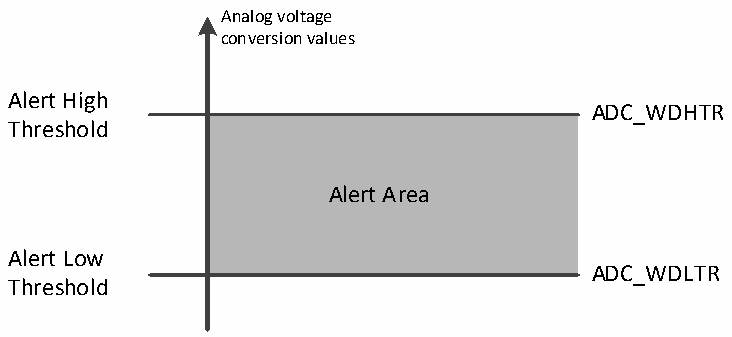

<!-- source-page: 150 -->

[← p.149](0149.md) · [index](../README.md) · [PDF p.150](https://ch32-riscv-ug.github.io/CH32V407/datasheet_zh/CH32V407RM.PDF#page=150) · [p.151 →](0151.md)

<!-- header: CH32V407应用手册 https://wch.cn -->

### 12.2.5 模拟看门狗

如果被 ADC 转换的模拟电压低于低阈值或高于高阈值，AWD 模拟看门狗状态位被设置。阈值设  
置位于 ADCx_WDHTR 和 ADCx_WDLTR 寄存器的最低 12 个有效位中。通过设置 ADCx_CTLR1 寄存器的  
AWDIE位以允许产生相应中断。通过设置ADCx_CFG寄存器的AWDRST_EN位可开启模拟看门狗复位。  

图12-4 模拟看门狗阈值区  
 <!-- rendered from the PDF; verify at https://ch32-riscv-ug.github.io/CH32V407/datasheet_zh/CH32V407RM.PDF#page=150 -->

🖼 Text parsed from the figure above

Analog voltage  
conversion values  
Alert High  
ADC_WDHTR  
<!-- image: p150-draw-image-00002 inside the figure -->
Threshold  
Alert Area  
Alert Low  
ADC_WDLTR  
Threshold  

配置ADCx_CTLR1寄存器的AWDSGL、AWDEN、JAWDEN及AWDCH[4:0]位选择模拟看门狗警戒的通道，  
具体关系见下表：  

<!-- p150-table-001 (table-12-4@1) -->
<table><caption>表12-4 模拟看门狗通道选择</caption><tr><th rowspan="2">模拟看门狗警戒通道</th><th colspan="4">ADCx_CTLR1寄存器控制位</th></tr><tr><td>AWDSGL</td><td>AWDEN</td><td>JAWDEN</td><td>AWDCH[4:0]</td></tr><tr><td>不警戒</td><td>忽略</td><td>0</td><td>0</td><td>忽略</td></tr><tr><td>所有注入通道</td><td>0</td><td>0</td><td>1</td><td>忽略</td></tr><tr><td>所有规则通道</td><td>0</td><td>1</td><td>0</td><td>忽略</td></tr><tr><td>所有注入和规则通道</td><td>0</td><td>1</td><td>1</td><td>忽略</td></tr><tr><td>单一注入通道</td><td>1</td><td>0</td><td>1</td><td>决定通道编号</td></tr><tr><td>单一规则通道</td><td>1</td><td>1</td><td>0</td><td>决定通道编号</td></tr><tr><td>单一注入和规则通道</td><td>1</td><td>1</td><td>1</td><td>决定通道编号</td></tr></table>

### 12.2.6 温度传感器

芯片内置温度传感器，连接ADC_INT16通道，通过ADC将传感器输出的电压转换成数字值来反  
馈芯片内部温度，推荐设置采样时间是 17.1μs。温度传感器输出的电压随温度线性变化，由于制  
造离散性，其线性变化的曲线斜率和偏移有所不同，所以内部温度传感器更适合于检测温度的变化，  
而不是测量绝对的温度。如果需要测量精确的温度，应该使用一个外置的温度传感器。  
通过设置ADCx_CTLR2寄存器的TSVREFE位置1，唤醒ADC内部采样通道，软件启动或外部触发  
启动ADC的温度传感器通道转换，读取数据结果（mV）。其中，数字值和温度(℃)换算公式如下：  
温度(℃) = ((VSENSE-V25)/Avg_Slope)+25  
V25：温度传感器在25℃下的电压值  
Avg_Slope：温度与VSENSE 曲线的平均斜率（mV/℃）  
参考数据手册电气特性章节中V25 和Avg_Slope的实际值。  
注：内部温度传感器上电（TSVREFE位从0改为1）需要一个建立时间，而ADC模块上电也需要一个  
建立时间（ADON位从0改为1），所以为了缩短等待时间，可以同时设置ADON和TSVREFE位。  
<!-- image: p150-draw-image-00001 bbox=[507.84, 786.36, 527.28, 796.68] -->
<!-- footer: V1.2 148 -->
