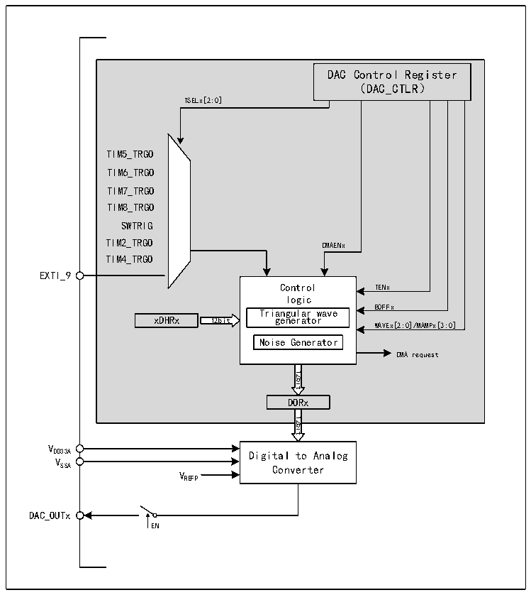

<!-- source-page: 167 -->

[← p.166](0166.md) · [index](../README.md) · [PDF p.167](https://ch32-riscv-ug.github.io/CH32V407/datasheet_zh/CH32V407RM.PDF#page=167) · [p.168 →](0168.md)

<!-- header: CH32V407应用手册 https://wch.cn -->

# 第 13 章 数字/模拟转换（DAC）

数字/模拟转换模块（DAC），包含2个12位电压输出数字/模拟转换器（DAC），转换2路数字  
信号为2路模拟电压信号并输出，支持双DAC通道独立或同步转换，支持12位数据左对齐或右对齐，  
支持12位或8位数据，支持外部事件触发转换。可实现三角波、噪声生成。支持DMA功能。  

## 13.1 主要特性

● 2个DAC转换器，每个转换器对应1个输出通道  
● 三角波、噪声波形发生器  
● 可配置8位或12位输出  
● 12位数据左对齐或右对齐  
● 双DAC同时或分别转换  
● 支持DMA功能  
● 多种触发事件  

## 13.2 功能描述

### 13.2.1 DAC模块结构

图13-1 DAC模块框图  
 <!-- rendered from the PDF; verify at https://ch32-riscv-ug.github.io/CH32V407/datasheet_zh/CH32V407RM.PDF#page=167 -->

🖼 Text parsed from the figure above

DAC Control Register  
（DAC_CTLR）  
TSELx[2:0]  
TIM5_TRGO  
TIM6_TRGO  
TIM7_TRGO  
TIM8_TRGO  
SWTRIG  
TIM2_TRGO  
DMAENx  
TIM4_TRGO  
EXTI_9  
Control TENx  
logic  
Triangular wave BOFFx  
xDHRx 12bit generator  
WAVEx[2:0]/MAMPx[3:0]  
Noise Generator  
DMA request  
12bit  
DORx  
12bit  
VDD33A  
Digital to Analog  
VSSA  
Converter  
VREFP  
DAC_OUTx  
EN  

<!-- image: p167-draw-image-00001 bbox=[507.84, 786.36, 527.28, 796.68] -->
<!-- footer: V1.2 165 -->
